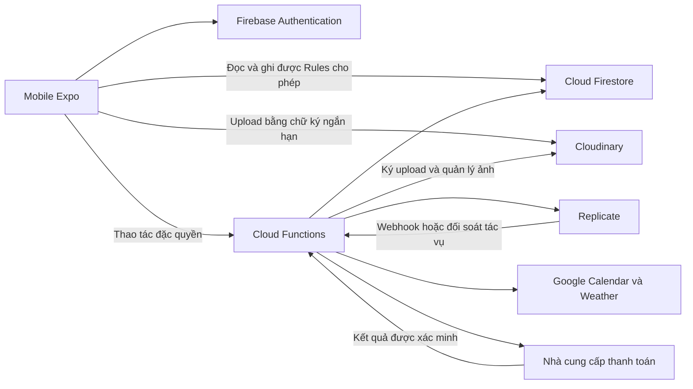

# Kế hoạch chuyển Shelfy sang Firebase, chỉ giữ mobile

Ngày lập: 26/09/2026. Trạng thái: kế hoạch triển khai, chưa bắt đầu migration.

- Nhánh: `feature/mobile-firebase-migration`.
- Nhánh gốc: `dev`, đã fetch và đối chiếu với `origin/dev`.
- Commit nền: `75d64a34a7aec5797f187268fabf882749a77320`.
- Phạm vi lần chuẩn bị này: tạo nhánh và tài liệu; chưa thay đổi ứng dụng, database hoặc dịch vụ đang chạy.

## 1. Mục tiêu và phạm vi

Giữ ứng dụng Expo tại `Mobile/Shelfy`; thay Spring Boot, Express và PostgreSQL bằng Firebase Authentication, Cloud Firestore và Cloud Functions. Cloudinary tiếp tục lưu ảnh, Firestore lưu metadata và đường dẫn. Kết thúc migration thì bỏ ứng dụng web, hai backend cũ và cấu hình triển khai tương ứng khỏi nhánh sản phẩm.

Giữ các luồng người dùng đang có: đăng ký/đăng nhập/khôi phục mật khẩu, hồ sơ/avatar, tủ đồ và bộ lọc, yêu thích/trạng thái quần áo, thống kê, phối đồ liên quan, thời tiết, Google Calendar, gợi ý hôm nay, xác nhận outfit, lịch sử mặc, thử đồ AI và lịch sử đã lưu, gói dịch vụ và thanh toán.

Không gộp việc thiết kế lại giao diện, đổi thuật toán stylist sang LLM, nâng Expo hoặc bổ sung tính năng sản phẩm mới vào đợt này. Việc điều chỉnh thanh toán theo kênh phân phối mobile sẽ được quyết định sớm vì có thể ảnh hưởng phạm vi.

Chưa biết hệ thống có dữ liệu/người dùng thật hay chưa. Mặc định bảo toàn dữ liệu và lịch sử; chỉ dùng phương án khởi tạo mới khi chủ dự án xác nhận không cần chuyển dữ liệu cũ.

## 2. Hiện trạng đã kiểm tra trong repository

| Thành phần | Bằng chứng trong code | Hệ quả khi chuyển |
|---|---|---|
| Mobile Expo SDK 57, React Native, JSX | `Mobile/Shelfy/package.json`, `app/` | Giữ routing và UI; xác minh SDK Firebase bằng bản chạy thử trước |
| Mobile gọi hai backend | `src/api/config.js`, `apiClient.js`, `nodeApiClient.js` | Cần chuyển toàn bộ lớp dữ liệu, không chỉ đổi URL |
| JWT và cache người dùng | `src/contexts/AuthContext.jsx`, `src/api/tokenStore.js` | Thay quản lý phiên bằng Firebase Auth; người dùng đăng nhập lại sau chuyển đổi |
| Tủ đồ, upload, hồ sơ, subscription | Các module `src/api/*Api.js` gọi Core API | Chuyển dữ liệu và phân quyền theo Firebase UID |
| Calendar, weather, daily outfits, suggestions, trial, payments | `Nodejs/app.js`, `Nodejs/routes/` | Phân tách phần đọc/ghi Firestore và phần xử lý đặc quyền |
| Stylist hiện tại là rule-based | `Nodejs/services/ruleBasedStylist.js`, `routes/suggestions.js` | Tái sử dụng thuật toán; chưa cần thay bằng dịch vụ AI mới |
| Mobile thử đồ qua Node | `src/api/trialApi.js`, `node_try_on_sessions` | Đây là nguồn dữ liệu hoạt động của mobile; đối chiếu thêm bảng trial của Java để tránh bỏ sót |
| OAuth Calendar callback phía Node | `docs/mobile-google-calendar.md`, `Nodejs/routes/calendar.js` | Cần endpoint HTTPS thay thế dù bỏ web |
| Mật khẩu Spring dùng BCrypt | `BE/Shelfy/.../config/SecurityConfig.java` | Có thể thử import BCrypt vào Firebase Auth, phải kiểm tra đăng nhập thực tế |
| Web có trang admin riêng | `FE/Shelfyy/src/pages/AdminPage.jsx`, `Nodejs/routes/admin.js` | Phải có phương án quản trị tối thiểu khi bỏ web |
| Có test Node và mobile | `Nodejs/tests/calendar-oauth.test.js`, `Mobile/Shelfy/tests/*.test.cjs` | Giữ ý nghĩa test, cập nhật mock/provider khi chuyển |
| Mobile chưa có script lint/typecheck/test trong package | `Mobile/Shelfy/package.json` | Thiết lập kiểm tra phù hợp JSX trước khi dùng làm cổng nghiệm thu |

Tài liệu cũ được dùng làm tham khảo; hành vi trong code và kiểm thử thực tế là căn cứ xác nhận tính năng. Chưa đánh giá trạng thái production hoặc chạy toàn bộ app trong lần lập kế hoạch này.

## 3. Kiến trúc đề xuất



Các quyết định mặc định để triển khai:

1. **Giữ vị trí `Mobile/Shelfy` trong đợt chuyển đổi.** Không đổi đường dẫn hàng loạt cùng lúc với đổi backend.
2. **Ưu tiên thử Firebase JS SDK trước** để giảm thay đổi và giữ khả năng phát triển với Expo Go. Spike phải kiểm tra persistence đăng nhập, kết nối Functions, Firestore và hành vi mất mạng trên Android/iOS. Nếu cần native offline persistence hoặc App Check native mà phương án này không đáp ứng, chốt React Native Firebase + development build ngay tại checkpoint nền tảng; không dùng lẫn hai hệ Auth. [Hướng dẫn Expo](https://docs.expo.dev/guides/using-firebase/)
3. **Giữ tên các module `src/api/*` làm ranh giới với UI.** Thay phần triển khai bên trong theo từng luồng; dùng adapter chuyển Timestamp, ID chuỗi và kết quả phân trang sang dữ liệu màn hình cần. Không duy trì hai backend trong sản phẩm lâu dài.
4. **Firestore truy cập trực tiếp cho dữ liệu cá nhân thông thường.** Functions xử lý entitlement, quota, cập nhật nhiều tài liệu có ràng buộc, thao tác ảnh và dịch vụ ngoài.
5. **Functions kiểm tra quyền độc lập.** Admin SDK bỏ qua Security Rules, vì vậy xác thực UID, quyền sở hữu, trạng thái tài khoản và payload phải được kiểm tra trong từng thao tác máy chủ. [Firebase Rules](https://firebase.google.com/docs/firestore/security/rules-conditions)
6. **Gợi ý phối đồ chạy trên Functions ở bản đầu**, tái sử dụng rule-based stylist để giữ hành vi và kiểm soát lượt sử dụng. Weather được cache phía Functions; Calendar token chỉ lưu trong vùng máy chủ được bảo vệ.
7. **Tách môi trường thử nghiệm và production.** Dùng Emulator Suite cho test; region Firestore/Functions được chốt trước khi tạo tài nguyên. Functions deploy cần Blaze; lập hạn mức sử dụng theo tài khoản và theo dõi chi phí. [Cloud Functions](https://firebase.google.com/docs/functions/get-started)
8. **Không ghi song song SQL và Firestore mặc định.** Dùng môi trường Firebase thử nghiệm; chuyển production tại một mốc kiểm soát ghi dữ liệu. Nếu cần chuyển không gián đoạn thì phải bổ sung thiết kế đồng bộ riêng.

Cấu trúc dự kiến sau migration:

```text
Mobile/Shelfy/             # App hiện tại, lớp dữ liệu Firebase
functions/                # Functions và logic nghiệp vụ chuyển từ Node/Java
firebase.json             # Emulator và cấu hình triển khai
.firebaserc               # Alias môi trường, không chứa secret
firestore.rules
firestore.indexes.json
scripts/migration/        # Export, transform, import, reconcile
scripts/admin/            # Tác vụ quản trị tối thiểu có kiểm soát
docs/                     # Kiến trúc, vận hành, migration runbook
```

## 4. Hợp đồng dữ liệu và bảo mật

Đây là mô hình đề xuất; task 02 sẽ chốt field, index và quyền chi tiết theo truy vấn thực tế.

| Đường dẫn dự kiến | Dữ liệu | Quyền mobile |
|---|---|---|
| `users/{uid}` | Tên, thông tin hồ sơ, avatar | Chủ tài khoản sửa allowlist trường hồ sơ |
| `users/{uid}/wardrobe/{itemId}` | Quần áo, ảnh, category, season, favorite, trạng thái | Chủ tài khoản đọc/ghi trường thông thường; khóa thống kê do server quản lý |
| `users/{uid}/dailyOutfits/{id}` | Outfit và snapshot món đồ lúc mặc | Chủ tài khoản đọc; xác nhận qua Function để cập nhật nhất quán |
| `users/{uid}/suggestions/{id}` | Gợi ý và context tạo | Chủ tài khoản đọc; server tạo/xác nhận |
| `users/{uid}/tryOns/{jobId}` | Trạng thái, ảnh vào/ra, saved | Chủ tài khoản đọc; server cập nhật qua các thao tác có kiểm tra |
| `users/{uid}/weather/{id}` | Snapshot thời tiết có thời điểm | Chủ tài khoản đọc; server ghi |
| `users/{uid}/calendarEvents/{id}` | Sự kiện đã chuẩn hóa | Chủ tài khoản đọc; server ghi |
| `users/{uid}/integrationStatus/{provider}` | Trạng thái kết nối không chứa token | Chủ tài khoản đọc |
| `users/{uid}/entitlements/{id}` | Gói, hạn dùng, quota/lượt dùng | Chủ tài khoản đọc; chỉ server ghi |
| `users/{uid}/payments/{id}` | Kết quả thanh toán đã lọc thông tin nhạy cảm | Chủ tài khoản đọc; chỉ server ghi |
| `plans/{planId}` | Gói công khai | Mobile chỉ đọc |
| Các collection máy chủ riêng | OAuth state/token, webhook receipts, upload intents, audit, migration mappings, trạng thái khóa tài khoản | Mobile không được đọc hoặc ghi |

Quy ước phải được kiểm thử:

- UID là danh tính gốc; `legacyUserId` và bảng mapping chỉ hỗ trợ import/đối soát. ID tài liệu là chuỗi, không ép về số ở UI.
- Timestamp lưu thống nhất; ngày mặc dùng `dateKey` và timezone đã xác định. Bảo toàn ý nghĩa ngày từ dữ liệu SQL không có timezone.
- Không lưu cả tủ đồ trong một document. Danh sách dùng cursor và giới hạn; kiểm kê truy vấn category/season/color/favorite/date/saved để tạo index.
- Chốt hành vi tìm kiếm `q` ngay từ đầu, đặc biệt tìm không dấu và tìm giữa chuỗi. Không thay bằng lọc trên một trang rồi báo là tìm toàn bộ tủ đồ; chọn phương án đáp ứng corpus thực tế và ghi rõ giới hạn.
- Ảnh lưu `secureUrl`, `publicId`, `resourceType`, kích thước, định dạng và liên kết chủ sở hữu. Upload phải có intent/chữ ký ràng buộc namespace của user, bước xác minh hoàn tất trước khi gắn ảnh vào item.
- `CLOUDINARY_API_SECRET`, token Replicate, Google client secret và bí mật thanh toán chỉ ở môi trường máy chủ/secret manager. Cloudinary hướng dẫn ký upload phía server. [Cloudinary](https://cloudinary.com/documentation/client_side_uploading)
- Firestore Rules không bảo vệ một URL ảnh Cloudinary công khai. Chốt riêng quyền truy cập và thời hạn lưu ảnh người dùng dùng cho thử đồ; thử nghiệm URL tạm nếu ảnh cần riêng tư.
- Firestore và Cloudinary không có transaction chung: dùng trạng thái chờ, retry và dọn ảnh mồ côi; không xóa ảnh còn được lịch sử tham chiếu.
- Premium, quota, role, trạng thái khóa tài khoản, số lần mặc và trạng thái AI không được người dùng tự gán. Rules cần chặn cả create lẫn update; Functions và thao tác quản trị dùng cùng ràng buộc nghiệp vụ.
- Callback ngoài hệ thống không có Firebase login: xác minh theo giao thức nhà cung cấp, chống xử lý lặp và kiểm tra dữ liệu máy chủ; không tin kết quả do mobile gửi.

## 5. Danh sách công việc theo thứ tự

Mỗi task là một commit hoặc một nhóm commit nhỏ, khoảng 2–5 file trọng tâm. Nếu thực tế vượt phạm vi thì chia tiếp theo thao tác/màn hình trước khi sửa. Mỗi task gồm cả đường đi dữ liệu, quyền và kiểm thử của chính luồng đó; không làm toàn bộ database rồi mới nối UI.

### Giai đoạn A — Xác nhận nền tảng và rủi ro sớm

- [ ] **01. Lập bảng hành vi và dữ liệu cần giữ.** Phụ thuộc: không. File: `docs/feature-parity.md`, `docs/migration-inventory.md` (mới). Nghiệm thu: mỗi API mobile hiện có được map sang tác vụ đích; admin và dữ liệu chỉ web sử dụng được phân loại rõ; xác định có dữ liệu thật cần chuyển. Kiểm tra: đối chiếu module API, màn hình và schema SQL; chạy baseline test hiện có và ghi lỗi sẵn có.
- [ ] **02. Chốt model, quyền và truy vấn.** Phụ thuộc: 01. File: `docs/firebase-data-model.md`, `docs/firebase-access-matrix.md` (mới). Nghiệm thu: mapping ID/timestamp/enum, index, search, subscription và quyền từng field có quyết định; bổ sung chiến lược khóa/xóa tài khoản. Kiểm tra: đi qua tất cả truy vấn trong bảng parity bằng dữ liệu mẫu.
- [ ] **03. Spike Firebase trên Expo hiện tại.** Phụ thuộc: 02. File: `Mobile/Shelfy/package.json`, lockfile, `src/firebase/client.js`, `app.json`, `docs/firebase-sdk-decision.md`. Nghiệm thu: chốt JS SDK hoặc native SDK; login giữ phiên sau restart, Firestore và Function chạy trên thiết bị; mô tả đúng giới hạn offline. Kiểm tra: Android/iOS trên cấu hình SDK 57 được xác minh từ tài liệu phiên bản; không tự nâng Expo để né lỗi.
- [ ] **04. Thử import tài khoản cũ.** Phụ thuộc: 02, 03. File: `scripts/migration/auth-spike.*`, fixture an toàn, báo cáo. Nghiệm thu: import mẫu BCrypt và đăng nhập thật ở staging; mapping UID/email và tài khoản disabled rõ ràng; có phương án reset password nếu không tương thích. Kiểm tra: account trùng email, hash lỗi, chạy lại không nhân đôi; không log hash/token. Firebase hỗ trợ import BCRYPT nhưng cần xác minh dữ liệu thực tế. [Auth import](https://firebase.google.com/docs/auth/admin/import-users)
- [ ] **05. Chốt thanh toán và vận hành khi bỏ web.** Phụ thuộc: 01. File: `docs/mobile-payment-decision.md`, `docs/admin-operations.md`. Nghiệm thu: biết kênh demo/APK/App Store/Google Play, provider thanh toán và các thao tác admin cần giữ. Kiểm tra: đối chiếu chính sách kênh phát hành; lập mapping khóa user, đổi gói, xem giao dịch, audit sang công cụ vận hành có kiểm soát.

**Checkpoint A:** SDK, import tài khoản, model dữ liệu và thanh toán có kết luận trước khi chuyển hàng loạt. Không tự quyết định bỏ dữ liệu hoặc bỏ chức năng. Nếu chỉ cần demo thì ghi rõ giới hạn, không coi đó là nghiệm thu phát hành production.

### Giai đoạn B — Nền tảng Firebase và tài khoản

- [ ] **06. Cấu hình môi trường, emulator và secrets.** Phụ thuộc: checkpoint A. File: `firebase.json`, `.firebaserc`, `functions/package.json`, `functions/src/index.*`, env example. Nghiệm thu: môi trường phân biệt rõ, Functions không chứa secret trong code, emulator khởi động được. Kiểm tra: gọi Function bằng user hợp lệ/không đăng nhập; cấu hình region, runtime và billing được ghi lại trước deploy staging.
- [ ] **07. Thiết lập Rules và bộ kiểm tra nền tảng.** Phụ thuộc: 02, 06. File: `firestore.rules`, `firestore.indexes.json`, bộ test Rules, cấu hình lint/typecheck theo JSX. Nghiệm thu: mặc định deny, hai user không đọc/ghi chéo nhau, trường đặc quyền bị khóa. Kiểm tra: Emulator tests cho create/update/delete và truy vấn; chạy lint, kiểm tra kiểu với cấu hình phù hợp thay vì ép chuyển toàn bộ sang TypeScript.
- [ ] **08. Chuyển đăng ký/đăng nhập/đăng xuất.** Phụ thuộc: 03, 07. File: `src/api/authApi.js`, `src/contexts/AuthContext.jsx`, `src/api/tokenStore.js`, test Auth. Nghiệm thu: phiên do Firebase quản lý, logout xóa dữ liệu phiên cũ, UI không hiện dữ liệu user trước khi đổi tài khoản. Kiểm tra: restart app, token hết hạn, mất mạng, tài khoản disabled, đăng ký thành công nhưng tạo profile thất bại rồi retry.
- [ ] **09. Chuyển hồ sơ và khôi phục mật khẩu.** Phụ thuộc: 08. File: `src/api/userApi.js`, màn hình profile và hai màn hình password, test. Nghiệm thu: sửa hồ sơ đúng allowlist; đổi mật khẩu có xác thực lại khi cần; email reset mở luồng mới và xử lý mã hết hạn. Kiểm tra: đổi tài khoản, mã dùng lại, hủy thao tác. Avatar nối sau task 10.

**Checkpoint B:** Auth và Rules chạy qua emulator/staging; login/logout/reset password trên thiết bị; không lộ dữ liệu chéo user. Thiết lập script lint/typecheck/test tái lập được trước các task tiếp theo.

### Giai đoạn C — Ảnh và tủ đồ

- [ ] **10. Upload Cloudinary có xác minh.** Phụ thuộc: 08. File: Functions upload, `src/api/uploadApi.js`, hồ sơ avatar, test upload. Nghiệm thu: ký ngắn hạn, giới hạn loại/kích thước, xác minh asset và chủ sở hữu trước lưu metadata; đổi avatar giữ tham chiếu hợp lệ. Kiểm tra: file sai, chữ ký hết hạn, URL/publicId của người khác, upload thành công nhưng ghi Firestore thất bại.
- [ ] **11. Tủ đồ: thêm, chi tiết, sửa.** Phụ thuộc: 10. File: `src/api/wardrobeApi.js`, `adapters.js`, màn hình add/detail/edit khi cần. Nghiệm thu: thông tin và ảnh đúng schema, string ID hoạt động, không nhận trường server quản lý từ client. Kiểm tra: create/edit/read trên thiết bị và Rules của user khác.
- [ ] **12. Danh sách, bộ lọc, tìm kiếm, yêu thích.** Phụ thuộc: 11. File: `wardrobeApi.js`, `wardrobePreferenceApi.js`, màn hình wardrobe/favorites, test truy vấn. Nghiệm thu: phân trang không trùng/bỏ sót, giữ hành vi tìm kiếm đã chốt, favorite/trạng thái cập nhật đúng. Kiểm tra: dữ liệu vượt nhiều trang, ghép bộ lọc và index trên staging, danh sách rỗng.
- [ ] **13. Xóa item và vòng đời ảnh.** Phụ thuộc: 11. File: Function delete/cleanup, `wardrobeApi.js`, test vòng đời asset. Nghiệm thu: retry an toàn, lịch sử cũ vẫn hiển thị snapshot, ảnh được giữ/xóa theo tham chiếu và retention đã chốt. Kiểm tra: callback xóa lặp, Cloudinary lỗi, item có ảnh được nhiều bản ghi dùng, asset import thiếu publicId.
- [ ] **14. Thống kê và phối đồ liên quan.** Phụ thuộc: 12. File: Functions stats/pairings, `wardrobeApi.js`, test. Nghiệm thu: số lượng/danh mục/số lần mặc và gợi ý liên quan tương đương luồng cũ; mobile không sửa trực tiếp số liệu bảo vệ. Kiểm tra: tủ đồ rỗng, CRUD liên tiếp, request đồng thời, đối chiếu fixture với hành vi cũ.

**Checkpoint C:** Người dùng đăng ký → tải ảnh → thêm/sửa/tìm/yêu thích/xóa đồ → xem thống kê hoàn chỉnh. Đo lượt đọc trên tập dữ liệu mẫu; không nghe realtime toàn bộ lịch sử hoặc tải toàn bộ dữ liệu để phân trang.

### Giai đoạn D — Ngữ cảnh và phối đồ hằng ngày

- [ ] **15. Thời tiết.** Phụ thuộc: 08. File: Functions weather/cache, `weatherApi.js`, test. Nghiệm thu: giữ weather/reverse geocoding, timeout và cache có thời điểm; từ chối quyền vị trí vẫn dùng app được. Kiểm tra: quyền vị trí bị chặn, provider lỗi, dữ liệu cũ, không phát sinh request lặp vô hạn.
- [ ] **16. Calendar OAuth.** Phụ thuộc: 08. File: Functions connect/callback, `calendarApi.js`, test OAuth. Nghiệm thu: callback HTTPS mới, state một lần có hạn và gắn UID, token chỉ server đọc; mở trình duyệt/quay về app không phụ thuộc FE cũ. Kiểm tra: cấp/từ chối quyền, state giả hoặc dùng lại, đóng trình duyệt giữa chừng.
- [ ] **17. Calendar đồng bộ và ngắt kết nối.** Phụ thuộc: 16. File: Functions sync/disconnect, `calendarApi.js`, test. Nghiệm thu: refresh token, lịch trong ngày và trạng thái kết nối đúng; ngắt kết nối dọn credential/cache cần thiết. Kiểm tra: token bị thu hồi, không có sự kiện, sự kiện cả ngày và khác timezone.
- [ ] **18. Gợi ý hôm nay.** Phụ thuộc: 12, 15, 17. File: Functions stylist/suggestions, `suggestionApi.js`, test. Nghiệm thu: giữ rule-based algorithm và shape dữ liệu UI, lưu context và lấy lại gợi ý trong ngày; không gọi Gemini ngoài ý muốn. Kiểm tra: fixture cũ/mới, thiếu weather/calendar, tủ đồ không đủ món, giới hạn lượt và request đồng thời.
- [ ] **19. Xác nhận outfit và lịch sử mặc.** Phụ thuộc: 18. File: Function confirm, `dailyOutfitApi.js`, màn hình wear-history khi cần, test. Nghiệm thu: cập nhật lịch sử/số lần mặc/xác nhận suggestion nhất quán, có khóa chống xác nhận lặp; snapshot giữ lịch sử khi item bị xóa. Kiểm tra: bấm hai lần, retry khi mất mạng, đổi ngày theo timezone, lọc lịch sử nhiều trang.

**Checkpoint D:** Home → thời tiết/lịch → tạo gợi ý → xác nhận → mở lịch sử chạy hoàn chỉnh, không cần Node hoặc Java cho các luồng đã chuyển.

### Giai đoạn E — AI và gói dịch vụ

- [ ] **20. Tạo tác vụ thử đồ AI.** Phụ thuộc: 10, 11, model entitlement từ 02. File: Functions try-on create/quota, `trialApi.js`, test. Nghiệm thu: kiểm tra ownership, asset và quota ở server; trả job ID sớm; chống request lặp và xử lý lỗi giữa lúc tạo job/gọi Replicate. Kiểm tra: hai request đồng thời, timeout nhà cung cấp, không đủ lượt, không tiêu lượt hai lần hoặc tạo tác vụ mồ côi không đối soát được.
- [ ] **21. Hoàn tất tác vụ và lịch sử AI.** Phụ thuộc: 20. File: Functions callback/reconcile, `trialApi.js`, `useTrialHistory.js`, test. Nghiệm thu: trạng thái kết thúc chỉ ghi hợp lệ, lưu kết quả lâu dài lên Cloudinary, lưu/bỏ lưu/xóa lịch sử đúng quyền; task có thời hạn và retry hữu hạn. Kiểm tra: webhook giả/trùng/đảo thứ tự, app đóng khi AI chạy, Replicate lỗi hoặc URL kết quả hết hạn.
- [ ] **22. Gói và entitlement.** Phụ thuộc: 05, 08. File: Functions entitlement, `subscriptionApi.js`, premium screen, test. Nghiệm thu: đọc gói/hạn/quota đúng, server quyết định quyền dùng AI, thao tác hủy gói có nghĩa rõ ràng theo provider; không giữ endpoint nâng cấp tự do. Kiểm tra: client tự sửa Premium bị chặn, hết hạn, tài khoản bị khóa, nhiều thiết bị.
- [ ] **23. Thanh toán đã chọn và đối soát.** Phụ thuộc: 22. File: Functions payment, `paymentApi.js`, premium screen, test. Nghiệm thu: giá/đơn hàng do server xác định; callback đã xác minh mới cập nhật entitlement; sự kiện lặp không cấp gói hai lần. Kiểm tra: sandbox success/cancel/fail, sai chữ ký/amount/order/user, callback đến muộn, refund/restore nếu provider yêu cầu. Nếu chọn store billing, chia riêng adapter Android và iOS trước khi làm.
- [ ] **24. Quản trị và xóa tài khoản.** Phụ thuộc: 13, 17, 21, 23. File: `scripts/admin/`, Functions deletion/disable, màn hình tài khoản khi cần, test. Nghiệm thu: có thao tác quản trị thay web với IAM/audit; khóa tài khoản chặn truy cập dữ liệu và Functions; xóa account xử lý Auth, subcollections, ảnh và OAuth theo retention. Kiểm tra: chạy dry-run, retry khi xóa dở, giao dịch cần giữ đối soát không bị xóa nhầm. Chia khóa account và xóa account thành hai commit độc lập.

**Checkpoint E:** AI và thanh toán được kiểm chứng bằng môi trường thử của nhà cung cấp, không chỉ mock; không lộ secret, không cấp gói/tiêu quota hai lần. Không đánh dấu hoàn thành nếu còn thiếu cấu hình tích hợp khiến luồng chưa chạy được.

### Giai đoạn F — Chuyển dữ liệu và phát hành

- [ ] **25. Công cụ chuyển dữ liệu theo từng nhóm.** Phụ thuộc: 04, model đã ổn định, checkpoint E. Chia task thành 25a Auth/profile; 25b wardrobe/assets/preferences; 25c outfits/suggestions/weather/calendar; 25d try-ons/payment/entitlement/audit. File: `scripts/migration/` và test từng nhóm. Nghiệm thu: dry-run, checkpoint/resume, mapping ID, import chạy lại không nhân đôi hoặc ghi đè dữ liệu mới hơn; đối soát số lượng/tham chiếu/giá trị trọng yếu. Kiểm tra: snapshot SQL thử nghiệm, dữ liệu lỗi/trùng/soft-delete, hai nguồn try-on, tài khoản thiếu hồ sơ, ảnh hỏng.
- [ ] **26. Diễn tập cutover và rollback.** Phụ thuộc: 25. File: `docs/firebase-cutover-runbook.md`, báo cáo staging. Nghiệm thu: có backup đã thử restore, thời gian chuyển đo được, cửa sổ dừng ghi và xử lý app cũ rõ ràng; rollback không làm mất dữ liệu mới. Kiểm tra: diễn tập từng bước ở staging với tình huống thất bại sau import và sau khi có ghi mới.
- [ ] **27. Kiểm thử phát hành và chuyển production.** Phụ thuộc: 26. File: CI mobile/Functions/Rules, cấu hình build, báo cáo nghiệm thu. Nghiệm thu: bộ parity đạt, bản Android/iOS dự kiến phát hành chạy với Firebase và không gọi host cũ; cấu hình production và monitoring đầy đủ. Kiểm tra: lint/typecheck/tests, build thực, smoke trên thiết bị, mất mạng/restart/đổi user, kiểm tra traffic và lỗi. Chỉ thực hiện deploy/cutover production trong phạm vi được chủ dự án giao ở bước triển khai.

**Checkpoint F:** Đối soát dữ liệu đạt; người dùng và quyền truy cập đúng; không còn request nghiệp vụ tới hai backend cũ. Thống nhất khoảng theo dõi vận hành và điều kiện quay lui trước khi mở ghi production.

### Giai đoạn G — Gỡ hệ thống cũ

- [ ] **28. Gỡ code và cấu hình cũ.** Phụ thuộc: checkpoint F và hết khoảng theo dõi đã thống nhất. Chia commit: 28a gỡ `FE/`; 28b gỡ `BE/` và `Nodejs/` sau khi logic/test cần thiết đã chuyển; 28c gỡ Docker/cấu hình URL JWT cũ, lệnh web và tài liệu lỗi thời. Nghiệm thu: repository chỉ cần mobile + Firebase + Cloudinary để chạy; không xóa asset mobile còn dùng. Kiểm tra: tìm import/URL/dependency mồ côi bằng `rg`, clean install và build mobile từ checkout mới.
- [ ] **29. Ngừng dịch vụ và bàn giao vận hành.** Phụ thuộc: 28. File: README, hướng dẫn môi trường, runbook và release notes. Nghiệm thu: ghi rõ cách chạy/deploy/backup/khôi phục, quản trị, chi phí và secret rotation; dịch vụ cũ chỉ dừng khi dữ liệu/backup và quyền vận hành đã bàn giao. Kiểm tra: chạy theo README từ đầu; xác nhận không còn callback/traffic cần server cũ. Không xóa volume/database production chỉ vì đã xóa code.

## 6. Kế hoạch chuyển dữ liệu và quay lui

1. **Kiểm kê và sao lưu:** thống kê bảng SQL, tài khoản hoạt động, BCrypt, ảnh, gói trả phí, giao dịch đang chờ và job AI chưa xong. Backup được lưu ngoài Git ở nơi có kiểm soát truy cập; kiểm tra restore trước khi dùng làm điểm quay lui.
2. **Dry-run:** export từ snapshot nhất quán, chuẩn hóa dữ liệu rồi import staging. Giữ manifest và mapping ổn định để chạy lại; không tự loại bản ghi lỗi mà thiếu báo cáo.
3. **Đối soát:** số lượng theo user/loại bản ghi, tham chiếu outfit–item–asset, trạng thái xóa, giá trị giao dịch, ngày hết hạn gói, quyền sở hữu và ảnh truy cập được. Không import access/refresh JWT cũ. Calendar mặc định yêu cầu kết nối lại ở app mới để tránh chuyển token thiếu khóa mã hóa/ngữ cảnh.
4. **Chuẩn bị cutover:** chọn bản mobile tối thiểu, chính sách app cũ và cửa sổ bảo trì. Khóa các đường ghi của app/web cũ, kể cả đăng ký, thanh toán và job AI; chờ hoàn tất hoặc đối soát các tác vụ đang chạy. Bản cũ cần nhận trạng thái bảo trì/cập nhật có giải thích thay vì tiếp tục ghi SQL sau snapshot.
5. **Chuyển chính thức:** backup cuối, import phần thay đổi bằng watermark/manifest sau khi nguồn đã ổn định, đối soát, smoke với tài khoản kiểm thử, rồi mở bản mobile mới. Không giữ hai database cùng nhận ghi độc lập.
6. **Quay lui trước khi mở ghi Firebase:** đưa app/dịch vụ về bản cũ từ điểm nền và snapshot đã kiểm chứng.
7. **Quay lui sau khi Firebase có dữ liệu mới:** chuyển về bảo trì, export delta Firebase và đối soát/áp ngược các thay đổi được hỗ trợ trước khi mở SQL lại. Tài khoản tạo mới/đổi mật khẩu Firebase cần xử lý Auth riêng (có thể yêu cầu reset); thanh toán và job đang chạy phải đối soát riêng. Nếu chưa có reverse mapping an toàn, ưu tiên sửa trên Firebase; không hứa rollback chỉ bằng đổi URL.
8. **Dọn dẹp:** giữ backup theo thời hạn đã thống nhất, theo dõi vận hành, rồi mới dừng hạ tầng cũ và thu hồi secret không còn dùng.

## 7. Cổng nghiệm thu và rủi ro chính

| Rủi ro | Cách kiểm soát / bằng chứng cần có |
|---|---|
| Mất tài khoản hoặc dữ liệu thật | Import thử, mapping UID cố định, backup restore, báo cáo đối soát trước cutover |
| Rules cho sửa Premium hoặc đọc chéo user | Emulator tests phủ create/update/delete, khóa fields và truy vấn; Functions kiểm tra riêng |
| Trải nghiệm search/phân trang giảm | Chốt yêu cầu tìm kiếm, test corpus nhiều trang và index staging |
| Ảnh mồ côi hoặc ảnh riêng tư thành public | Upload intent, xác minh asset, retention và quyền Cloudinary riêng, retry cleanup |
| Chi phí AI/Firestore tăng | Quota server, chống gọi lặp, giới hạn job, cache weather, đo reads/listeners và theo dõi billing |
| Mất quyền Calendar khi đổi callback | Staging OAuth callback mới, state chống replay, kiểm thử reconnect và token bị thu hồi |
| Callback thanh toán/AI đến nhiều lần | Idempotency key, transaction, receipt và cơ chế đối soát hữu hạn |
| App cũ tiếp tục ghi database cũ | Kế hoạch bảo trì/bản tối thiểu, chặn đường ghi trước snapshot cuối |
| Bỏ web làm mất công cụ admin | Task 05 và 24 hoàn tất trước khi xóa FE; không cấp quyền admin qua field client sửa được |
| Chỉ chạy tốt trong Expo Go | Nghiệm thu bằng bản build thiết bị của kênh phát hành thực tế |

Firestore tính phí đọc/ghi và listener có thể phát sinh lượt đọc; không dự toán chi phí chỉ từ dung lượng metadata. Ghi lại chi phí Firebase, Cloudinary, Replicate riêng bằng kịch bản số user/lượt upload/lượt AI dự kiến. [Firestore billing](https://firebase.google.com/docs/firestore/pricing)

Điều kiện hoàn tất toàn bộ đợt chuyển đổi:

- [ ] Toàn bộ luồng trong bảng parity có kết quả kiểm thử, hoặc thay đổi phạm vi được chủ dự án chấp nhận rõ ràng.
- [ ] Android/iOS theo phạm vi phát hành đã chạy thực tế; luồng lỗi và quyền thiết bị được kiểm tra.
- [ ] Không còn phụ thuộc runtime vào web, Java, Express cũ hoặc PostgreSQL.
- [ ] Migration và rollback được diễn tập; dữ liệu/người dùng/gói trả phí đối soát đạt.
- [ ] Bảo mật, quản trị, vòng đời ảnh, xóa tài khoản và quota được kiểm thử.
- [ ] Checkout mới cài đặt/chạy/build theo tài liệu mới; không chứa secret hoặc bản export dữ liệu thật.

## 8. Thông tin cần chốt khi bắt đầu triển khai

Những mục này không chặn việc lập kế hoạch; chúng chặn các task phụ thuộc nếu chưa có câu trả lời.

| Cần chốt | Mặc định trong kế hoạch | Cần trước |
|---|---|---|
| Có tài khoản/dữ liệu thật cần giữ không? | Bảo toàn, chuẩn bị migration đầy đủ | 01, 04 và 25 |
| Firebase project, quyền truy cập, region và billing | Staging riêng, production riêng; chưa tạo tài nguyên tính phí | 03, 06 và deploy |
| Giữ cả Android và iOS hay ưu tiên một nền tảng? | Lập kế hoạch cả hai; không coi nền tảng chưa test là đã đạt | 03 và 27 |
| Demo/APK nội bộ hay lên store? | Chưa mặc định VNPay là phương án phát hành store | 05 và 23 |
| Phạm vi admin cần giữ khi bỏ web? | Công cụ quản trị có kiểm soát, chưa xây dashboard mới | 05 và 24 |
| Ai được xem ảnh thử đồ, lưu trong bao lâu? | Ảnh theo chủ sở hữu; xác minh quyền Cloudinary riêng | 10 và 21 |
| Offline cần tới mức nào? | Giữ phiên, hiển thị lỗi/retry rõ; persistence dữ liệu phải chứng minh qua spike | 03 |
| Ngân sách và khoảng bảo trì/theo dõi? | Chưa cam kết chi phí hay thời gian downtime khi chưa đo staging | 06 và 26 |

Thanh toán nội dung/tính năng số trên mobile cần đối chiếu quy định theo thị trường và kênh phân phối; không tự bê nguyên luồng VNPay web vào bản phát hành store. Task 05 kiểm tra lại [Apple App Review Guidelines](https://developer.apple.com/app-store/review/guidelines/) và [Google Play Payments](https://support.google.com/googleplay/android-developer/answer/9858738) trước khi quyết định.

## 9. Cách thực hiện và báo cáo tiến độ

- Thứ tự ưu tiên: A → B → C → D → E → F → G. Tài liệu này là checklist gốc; tick task sau khi có bằng chứng kiểm tra.
- Mỗi commit chỉ xử lý một luồng hoặc một phần chuyển dữ liệu. Đặt commit theo nhóm `chore`, `feat`, `refactor`, `test`, `docs`; tránh một commit gom toàn bộ migration.
- Cuối mỗi checkpoint ghi phần đã chạy được, lỗi còn lại, dữ liệu đối soát và rủi ro mới vào báo cáo tiến độ. Không dùng việc build thành công thay cho nghiệm thu tích hợp.
- Chốt các quyết định ảnh hưởng dữ liệu thật, chi phí và kênh thanh toán với chủ dự án khi có phương án cụ thể. Những việc chuẩn bị local/emulator vẫn tiếp tục trong phạm vi đã giao.
- Chưa ước lượng ngày hoàn thành cố định: cần kết quả checkpoint A và số liệu migration thử. Tách thời gian code/test khỏi thời gian cấp quyền dịch vụ, xác minh OAuth và xét duyệt store.

Bước triển khai đầu tiên sau khi kế hoạch được xem xét: task 01–05, bắt đầu từ bảng parity và spike Firebase trên mobile hiện tại; chưa xóa backend hoặc web ở giai đoạn này.
