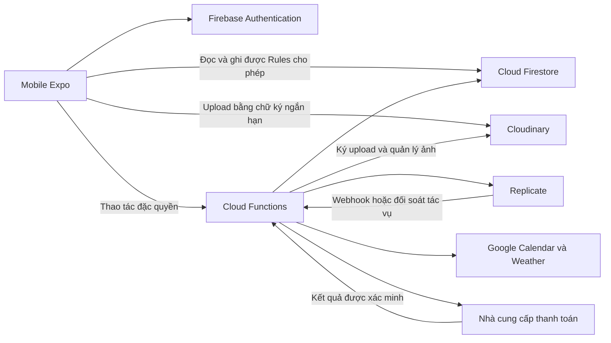

# Kế hoạch chuyển Shelfy sang Firebase, giữ mobile và landing page

Ngày lập: 26/09/2026. Trạng thái: đang triển khai nền tảng.

- Nhánh: `feature/mobile-firebase-migration`.
- Nhánh gốc: `dev`, đã fetch và đối chiếu với `origin/dev`.
- Commit nền: `75d64a34a7aec5797f187268fabf882749a77320`.
- Tiến độ: parity/inventory và bản nháp model/quyền hoàn thành; project Firebase chưa tạo; chưa có deployment hoặc thay đổi dịch vụ.

## 1. Mục tiêu và phạm vi

Giữ ứng dụng Expo tại `Mobile/Shelfy`; thay Spring Boot, Express và PostgreSQL bằng Firebase Authentication, Cloud Firestore và Cloud Functions. Cloudinary tiếp tục lưu ảnh, Firestore lưu metadata và đường dẫn. Theo cập nhật của chủ dự án, **giữ landing page web tại `FE/Shelfyy`, xóa toàn bộ phần web còn lại**. Kết thúc migration thì gỡ hai backend cũ và cấu hình triển khai không còn dùng khỏi nhánh sản phẩm.

Landing page giữ giao diện giới thiệu, nội dung, hình ảnh, logo, font, CSS, component và cấu hình build/hosting cần thiết. Gỡ đăng nhập/đăng ký web, khôi phục mật khẩu web, dashboard, tủ đồ, gợi ý, thử đồ, lịch sử, hồ sơ, Premium, thanh toán và admin web. Đổi các CTA đang dẫn vào ứng dụng web thành hướng dẫn tải/mở app; chỉ gắn link phát hành khi có URL thật. Landing page phải chạy độc lập với hai backend cũ và không giữ API client/JWT chỉ để phục vụ phần web đã bỏ.

Giữ các luồng người dùng đang có: đăng ký/đăng nhập/khôi phục mật khẩu, hồ sơ/avatar, tủ đồ và bộ lọc, yêu thích/trạng thái quần áo, thống kê, phối đồ liên quan, thời tiết, Google Calendar, gợi ý hôm nay, xác nhận outfit, lịch sử mặc, thử đồ AI và lịch sử đã lưu, gói dịch vụ và thanh toán.

Không gộp việc thiết kế lại giao diện, đổi thuật toán stylist sang LLM, nâng Expo hoặc bổ sung tính năng sản phẩm mới vào đợt này. Việc điều chỉnh thanh toán theo kênh phân phối mobile sẽ được quyết định sớm vì có thể ảnh hưởng phạm vi.

Chủ dự án xác nhận không cần chuyển dữ liệu hoặc tài khoản cũ. Bắt đầu bằng Firebase project và tài khoản mới, dùng dữ liệu giả lập khi thử nghiệm. Nếu yêu cầu đổi, dừng việc gỡ legacy và lập quy trình nhập dữ liệu riêng trước.

## 2. Hiện trạng đã kiểm tra trong repository

| Thành phần | Bằng chứng trong code | Hệ quả khi chuyển |
|---|---|---|
| Mobile Expo SDK 57, React Native, JSX | `Mobile/Shelfy/package.json`, `app/` | Giữ routing và UI; xác minh SDK Firebase bằng bản chạy thử trước |
| Mobile gọi hai backend | `src/api/config.js`, `apiClient.js`, `nodeApiClient.js` | Cần chuyển toàn bộ lớp dữ liệu, không chỉ đổi URL |
| JWT và cache người dùng | `src/contexts/AuthContext.jsx`, `src/api/tokenStore.js` | Thay quản lý phiên bằng Firebase Auth; người dùng đăng nhập lại sau chuyển đổi |
| Tủ đồ, upload, hồ sơ, subscription | Các module `src/api/*Api.js` gọi Core API | Chuyển dữ liệu và phân quyền theo Firebase UID |
| Calendar, weather, daily outfits, suggestions, trial, payments | `Nodejs/app.js`, `Nodejs/routes/` | Phân tách phần đọc/ghi Firestore và phần xử lý đặc quyền |
| Stylist hiện tại là rule-based | `Nodejs/services/ruleBasedStylist.js`, `routes/suggestions.js` | Tái sử dụng thuật toán; chưa cần thay bằng dịch vụ AI mới |
| Mobile thử đồ qua Node | `src/api/trialApi.js`, `node_try_on_sessions` | Đây là nguồn dữ liệu hoạt động của mobile; đối chiếu thêm bảng trial của Java để tránh bỏ sót |
| OAuth Calendar callback phía Node | `docs/mobile-google-calendar.md`, `Nodejs/routes/calendar.js` | Cần endpoint HTTPS thay thế dù bỏ web |
| Mật khẩu Spring dùng BCrypt | `BE/Shelfy/.../config/SecurityConfig.java` | Có thể thử import BCrypt vào Firebase Auth, phải kiểm tra đăng nhập thực tế |
| Web có trang admin riêng | `FE/Shelfyy/src/pages/AdminPage.jsx`, `Nodejs/routes/admin.js` | Phải có phương án quản trị tối thiểu khi bỏ web |
| Landing hiện có đăng nhập/đăng ký gọi backend | `FE/Shelfyy/src/pages/LandingPage.jsx`, `components/LandingHeader.jsx` | Giữ phần giới thiệu, gỡ auth/modal login và chuyển CTA sang mobile; rà soát dependency trước khi xóa |
| Có test Node và mobile | `Nodejs/tests/calendar-oauth.test.js`, `Mobile/Shelfy/tests/*.test.cjs` | Giữ ý nghĩa test, cập nhật mock/provider khi chuyển |
| Mobile chưa có script lint/typecheck/test trong package | `Mobile/Shelfy/package.json` | Thiết lập kiểm tra phù hợp JSX trước khi dùng làm cổng nghiệm thu |

Tài liệu cũ được dùng làm tham khảo; hành vi trong code và kiểm thử thực tế là căn cứ xác nhận tính năng. Chưa đánh giá trạng thái production hoặc chạy toàn bộ app trong lần lập kế hoạch này.

## 3. Kiến trúc đề xuất



Các quyết định mặc định để triển khai:

1. **Giữ vị trí `Mobile/Shelfy` trong đợt chuyển đổi.** Không đổi đường dẫn hàng loạt cùng lúc với đổi backend.
2. **Ưu tiên thử Firebase JS SDK trước** để giảm thay đổi và giữ khả năng phát triển với Expo Go. Spike phải kiểm tra persistence đăng nhập, kết nối Functions, Firestore và hành vi mất mạng trên Android/iOS. Nếu cần native offline persistence hoặc App Check native mà phương án này không đáp ứng, chốt React Native Firebase + development build ngay tại checkpoint nền tảng; không dùng lẫn hai hệ Auth. [Hướng dẫn Expo](https://docs.expo.dev/guides/using-firebase/)
3. **Giữ tên các module `src/api/*` làm ranh giới với UI.** Thay phần triển khai bên trong theo từng luồng; dùng adapter chuyển Timestamp, ID chuỗi và kết quả phân trang sang dữ liệu màn hình cần. Không duy trì hai backend trong sản phẩm lâu dài.
4. **Firestore truy cập trực tiếp cho dữ liệu cá nhân thông thường.** Functions xử lý entitlement, quota, cập nhật nhiều tài liệu có ràng buộc, thao tác ảnh và dịch vụ ngoài.
5. **Functions kiểm tra quyền độc lập.** Admin SDK bỏ qua Security Rules, vì vậy xác thực UID, quyền sở hữu, trạng thái tài khoản và payload phải được kiểm tra trong từng thao tác máy chủ. [Firebase Rules](https://firebase.google.com/docs/firestore/security/rules-conditions)
6. **Gợi ý phối đồ chạy trên Functions ở bản đầu**, tái sử dụng rule-based stylist để giữ hành vi và kiểm soát lượt sử dụng. Weather được cache phía Functions; Calendar token chỉ lưu trong vùng máy chủ được bảo vệ.
7. **Tách môi trường thử nghiệm và production.** Dùng Emulator Suite cho test; region Firestore/Functions được chốt trước khi tạo tài nguyên. Functions deploy cần Blaze; lập hạn mức sử dụng theo tài khoản và theo dõi chi phí. [Cloud Functions](https://firebase.google.com/docs/functions/get-started)
8. **Không ghi song song SQL và Firestore mặc định.** Dùng môi trường Firebase thử nghiệm; chuyển production tại một mốc kiểm soát ghi dữ liệu. Nếu cần chuyển không gián đoạn thì phải bổ sung thiết kế đồng bộ riêng.

Landing page là trang giới thiệu độc lập; không nằm trong đường đi dữ liệu nghiệp vụ của mobile trong sơ đồ trên. Giữ bộ build React/Vite hiện có ở phạm vi tối thiểu, không chuyển framework trong đợt này.

Cấu trúc dự kiến sau migration:

```text
Mobile/Shelfy/             # App hiện tại, lớp dữ liệu Firebase
FE/Shelfyy/                # Chỉ landing page, asset và build/hosting cần thiết
functions/                # Functions và logic nghiệp vụ chuyển từ Node/Java
firebase.json             # Emulator và cấu hình triển khai
.firebaserc               # Alias môi trường, không chứa secret
firestore.rules
firestore.indexes.json
scripts/migration/        # Export, transform, import, reconcile
scripts/admin/            # Tác vụ quản trị tối thiểu có kiểm soát
docs/                     # Kiến trúc, vận hành, migration runbook
```

## 4. Hợp đồng dữ liệu và bảo mật

Đây là mô hình đề xuất; task 02 sẽ chốt field, index và quyền chi tiết theo truy vấn thực tế.

| Đường dẫn dự kiến | Dữ liệu | Quyền mobile |
|---|---|---|
| `users/{uid}` | Tên, thông tin hồ sơ, avatar | Chủ tài khoản sửa allowlist trường hồ sơ |
| `users/{uid}/wardrobe/{itemId}` | Quần áo, ảnh, category, season, favorite, trạng thái | Chủ tài khoản đọc/ghi trường thông thường; khóa thống kê do server quản lý |
| `users/{uid}/dailyOutfits/{id}` | Outfit và snapshot món đồ lúc mặc | Chủ tài khoản đọc; xác nhận qua Function để cập nhật nhất quán |
| `users/{uid}/suggestions/{id}` | Gợi ý và context tạo | Chủ tài khoản đọc; server tạo/xác nhận |
| `users/{uid}/tryOns/{jobId}` | Trạng thái, ảnh vào/ra, saved | Chủ tài khoản đọc; server cập nhật qua các thao tác có kiểm tra |
| `users/{uid}/weatherSnapshots/current` | Snapshot thời tiết gần nhất, cache 30 phút và tọa độ làm tròn | Chủ tài khoản đọc; chỉ server ghi |
| `users/{uid}/calendarEvents/{id}` | Sự kiện đã chuẩn hóa | Chủ tài khoản đọc; server ghi |
| `users/{uid}/integrationStatus/{provider}` | Trạng thái kết nối không chứa token | Chủ tài khoản đọc |
| `users/{uid}/entitlements/{id}` | Gói, hạn dùng, quota/lượt dùng | Chủ tài khoản đọc; chỉ server ghi |
| `users/{uid}/payments/{id}` | Kết quả thanh toán đã lọc thông tin nhạy cảm | Chủ tài khoản đọc; chỉ server ghi |
| `plans/{planId}` | Gói công khai | Mobile chỉ đọc |
| Các collection máy chủ riêng | OAuth state/token, webhook receipts, upload intents, audit, migration mappings, trạng thái khóa tài khoản | Mobile không được đọc hoặc ghi |

Quy ước phải được kiểm thử:

- UID là danh tính gốc; `legacyUserId` và bảng mapping chỉ hỗ trợ import/đối soát. ID tài liệu là chuỗi, không ép về số ở UI.
- Timestamp lưu thống nhất; ngày mặc dùng `dateKey` và timezone đã xác định. Bảo toàn ý nghĩa ngày từ dữ liệu SQL không có timezone.
- Không lưu cả tủ đồ trong một document. Danh sách dùng cursor và giới hạn; kiểm kê truy vấn category/season/color/favorite/date/saved để tạo index.
- Chốt hành vi tìm kiếm `q` ngay từ đầu, đặc biệt tìm không dấu và tìm giữa chuỗi. Không thay bằng lọc trên một trang rồi báo là tìm toàn bộ tủ đồ; chọn phương án đáp ứng corpus thực tế và ghi rõ giới hạn.
- Ảnh lưu `secureUrl`, `publicId`, `resourceType`, kích thước, định dạng và liên kết chủ sở hữu. Upload phải có intent/chữ ký ràng buộc namespace của user, bước xác minh hoàn tất trước khi gắn ảnh vào item.
- `CLOUDINARY_API_SECRET`, token Replicate, Google client secret và bí mật thanh toán chỉ ở môi trường máy chủ/secret manager. Cloudinary hướng dẫn ký upload phía server. [Cloudinary](https://cloudinary.com/documentation/client_side_uploading)
- Firestore Rules không bảo vệ một URL ảnh Cloudinary công khai. Chốt riêng quyền truy cập và thời hạn lưu ảnh người dùng dùng cho thử đồ; thử nghiệm URL tạm nếu ảnh cần riêng tư.
- Firestore và Cloudinary không có transaction chung: dùng trạng thái chờ, retry và dọn ảnh mồ côi; không xóa ảnh còn được lịch sử tham chiếu.
- Premium, quota, role, trạng thái khóa tài khoản, số lần mặc và trạng thái AI không được người dùng tự gán. Rules cần chặn cả create lẫn update; Functions và thao tác quản trị dùng cùng ràng buộc nghiệp vụ.
- Callback ngoài hệ thống không có Firebase login: xác minh theo giao thức nhà cung cấp, chống xử lý lặp và kiểm tra dữ liệu máy chủ; không tin kết quả do mobile gửi.

## 5. Danh sách công việc theo thứ tự

Mỗi task là một commit hoặc một nhóm commit nhỏ, khoảng 2–5 file trọng tâm. Nếu thực tế vượt phạm vi thì chia tiếp theo thao tác/màn hình trước khi sửa. Mỗi task gồm cả đường đi dữ liệu, quyền và kiểm thử của chính luồng đó; không làm toàn bộ database rồi mới nối UI.

### Giai đoạn A — Xác nhận nền tảng và rủi ro sớm

- [x] **01. Lập bảng hành vi và dữ liệu cần giữ.** Phụ thuộc: không. File: `docs/feature-parity.md`, `docs/migration-inventory.md`. Nghiệm thu: mỗi API mobile hiện có được map sang tác vụ đích; admin và dữ liệu chỉ web sử dụng được phân loại rõ; dữ liệu hiện tại được phân loại. Kiểm tra: đối chiếu module API, màn hình và schema SQL; chạy baseline test hiện có và ghi lỗi sẵn có. Chủ dự án xác nhận không cần chuyển dữ liệu hoặc tài khoản cũ.
- [x] **02. Chốt model, quyền và truy vấn.** Phụ thuộc: 01. File: `docs/firebase-data-model.md` (bao gồm access matrix). Nghiệm thu: mapping ID/timestamp/enum, index, search, subscription và quyền từng field được đề xuất; điểm cần quyết định còn được ghi rõ; bổ sung chiến lược khóa/xóa tài khoản. Kiểm tra: đi qua tất cả truy vấn trong bảng parity bằng dữ liệu mẫu.
- [ ] **03. Spike Firebase trên Expo hiện tại.** Phụ thuộc: 02. File: `Mobile/Shelfy/package.json`, lockfile, `src/firebase/client.js`, `app.json`, `docs/firebase-sdk-decision.md`. Nghiệm thu: chốt JS SDK hoặc native SDK; login giữ phiên sau restart, Firestore và Function chạy trên thiết bị; mô tả đúng giới hạn offline. Đã cài Firebase JS SDK tương thích SDK57 và chạy Auth/Firestore với Emulator; còn kiểm tra Functions và APK trên thiết bị.
- [x] **04. Thử import tài khoản cũ.** Phụ thuộc: 02, 03. Trạng thái: bỏ theo xác nhận của chủ dự án rằng không cần chuyển dữ liệu/tài khoản; không import BCrypt hoặc session/token cũ. Nếu phạm vi này thay đổi, mở kế hoạch migration tài khoản riêng trước khi làm.
- [x] **05. Chốt thanh toán và vận hành khi bỏ web.** Phụ thuộc: 01. File: phần còn lại thuộc task 24 và hồ sơ cấu hình lúc có Firebase project. Nghiệm thu: kênh ban đầu là APK/test nội bộ; provider đang có là VNPay. Giữ VNPay cho thử nghiệm APK, không coi đây là quyết định store billing; admin web được gỡ sau khi có cách quản trị mới.

**Checkpoint A:** SDK, import tài khoản, model dữ liệu và thanh toán có kết luận trước khi chuyển hàng loạt. Không tự quyết định bỏ dữ liệu hoặc bỏ chức năng. Nếu chỉ cần demo thì ghi rõ giới hạn, không coi đó là nghiệm thu phát hành production.

### Giai đoạn B — Nền tảng Firebase và tài khoản

- [ ] **06. Cấu hình môi trường, emulator và secrets.** Phụ thuộc: checkpoint A. File: `firebase.json`, `.firebaserc`, `functions/package.json`, `functions/src/index.*`, env example. Nghiệm thu: môi trường phân biệt rõ, Functions không chứa secret trong code, emulator khởi động được. Kiểm tra: gọi Function bằng user hợp lệ/không đăng nhập; cấu hình region, runtime và billing được ghi lại trước deploy staging. Chưa có project ID; emulator dùng project ID demo đến khi chủ dự án tạo Firebase project.
- [ ] **07. Thiết lập Rules và bộ kiểm tra nền tảng.** Phụ thuộc: 02, 06. File: `firestore.rules`, `firestore.indexes.json`, bộ test Rules, cấu hình lint/typecheck theo JSX. Rules mặc định deny; 9 bài Rules Emulator qua; Expo Doctor 21/21; ESLint toàn app hiện 0 lỗi/0 cảnh báo. `tsc --noEmit` không chạy được như typecheck vì app JavaScript chưa có `tsconfig.json`; chưa đóng vì APK/project thật chưa kiểm tra.
- [ ] **08. Chuyển đăng ký/đăng nhập/đăng xuất.** Phụ thuộc: 03, 07. File: `src/api/authApi.js`, `src/contexts/AuthContext.jsx`, `src/api/tokenStore.js`, test Auth. Đã chuyển API và Context sang Firebase Auth, tạo hồ sơ theo UID, bỏ cache JWT cũ khỏi luồng Auth; 3 bài Emulator đăng ký/đăng nhập/đăng xuất đều qua. Còn kiểm tra restart app, mất mạng và tài khoản vô hiệu hóa trên thiết bị.
- [ ] **09. Chuyển hồ sơ và khôi phục mật khẩu.** Phụ thuộc: 08. File: `src/api/userApi.js`, màn hình profile và hai màn hình password, test. Đã chuyển sửa tên, đổi mật khẩu có re-auth, ký upload Cloudinary phía server, tạo App Link reset mật khẩu Firebase Hosting với package `com.shelfy.app` và parse action code trong app. Còn cấu hình Firebase project/SHA certificate thật, kiểm tra email reset trên APK, ảnh trên thiết bị và di trú hết các trường hồ sơ. Hướng dẫn: `docs/firebase-auth-app-links.md`.

**Checkpoint B:** Auth và Rules chạy qua emulator/staging; login/logout/reset password trên thiết bị; không lộ dữ liệu chéo user. Thiết lập script lint/typecheck/test tái lập được trước các task tiếp theo.

### Giai đoạn C — Ảnh và tủ đồ

- [ ] **10. Upload Cloudinary có xác minh.** Phụ thuộc: 08. File: Functions upload, `src/api/uploadApi.js`, hồ sơ avatar, test upload. Callable ký upload theo UID/thư mục, giới hạn 40 chữ ký mỗi tài khoản mỗi ngày; ảnh chân dung thử đồ dùng `authenticated`, upload Cloudinary được kiểm tra URL/public ID/type, chữ ký đúng định dạng Cloudinary. URL tải chân dung cấp tạm 1 giờ cho Replicate rồi ảnh bị xóa. Chưa thể xác minh upload thật vì chưa có cấu hình Cloudinary/project; còn kiểm tra trên thiết bị, lỗi ghi metadata và luồng dọn ảnh mồ côi.
- [ ] **11. Tủ đồ: thêm, chi tiết, sửa.** Phụ thuộc: 10. File: `functions/wardrobeItems.js`, `src/api/wardrobeApi.js`, `adapters.js`, màn hình add/detail/edit. Create/delete chạy qua authenticated Functions; server kiểm tra payload/asset ownership và cập nhật capacity trong transaction; Rules chặn client tự tạo/xóa item. Unit + Emulator e2e CRUD, favorite, quota và mark-worn đã qua; còn kiểm tra ảnh Cloudinary/luồng đầy đủ trên APK.
- [ ] **12. Danh sách, bộ lọc, tìm kiếm, yêu thích.** Phụ thuộc: 11. File: `wardrobeApi.js`, `wardrobePreferenceApi.js`, màn hình wardrobe/favorites, test truy vấn. Category/index, tìm chuỗi trong tên/thương hiệu, phân trang bằng cursor, favorite và status đã nối; Emulator test truy vấn/cập nhật qua. Còn kiểm thử nhiều trang và kết hợp bộ lọc trên tập dữ liệu lớn.
- [ ] **13. Xóa item và vòng đời ảnh.** Phụ thuộc: 11. File: Function delete/cleanup, `wardrobeApi.js`, test vòng đời asset. Nghiệm thu: retry an toàn, lịch sử cũ vẫn hiển thị snapshot, ảnh được giữ/xóa theo tham chiếu và retention đã chốt. Kiểm tra: callback xóa lặp, Cloudinary lỗi, item có ảnh được nhiều bản ghi dùng, asset import thiếu publicId.
- [x] **14. Thống kê và phối đồ liên quan.** Phụ thuộc: 12. File: `wardrobeApi.js`, `functions/index.js`. Mobile dùng tổng món, món đã mặc và giới hạn tủ đồ; Firestore aggregation cùng entitlement callable cung cấp ba số liệu này, mark-worn do Function cập nhật có request receipt chống lặp. Emulator xác nhận CRUD/favorite/mark-worn và thống kê. Pairing chỉ được trang web dùng, không có mobile consumer; gỡ stub rỗng khỏi mobile theo phạm vi landing-only.

**Checkpoint C:** Người dùng đăng ký → tải ảnh → thêm/sửa/tìm/yêu thích/xóa đồ → xem thống kê hoàn chỉnh. Đo lượt đọc trên tập dữ liệu mẫu; không nghe realtime toàn bộ lịch sử hoặc tải toàn bộ dữ liệu để phân trang.

### Giai đoạn D — Ngữ cảnh và phối đồ hằng ngày

- [ ] **15. Thời tiết.** Phụ thuộc: 08. File: Functions weather/cache, `weatherApi.js`, test. Đã chuyển gọi Open-Meteo và reverse geocoding sang Functions; snapshot cache theo UID/tọa độ làm tròn trong 30 phút, không lưu raw payload; mobile đọc snapshot mới nhất trực tiếp từ Firestore. Còn kiểm tra trên APK với provider thực và quyền vị trí bị từ chối. Kiểm tra: Emulator Rules cho phép chủ đọc và chặn ghi/chủ khác; unit tests kiểm tra cache, timeout và lỗi geocoder.
- [ ] **16. Calendar OAuth.** Phụ thuộc: 08. File: Functions connect/callback, `calendarApi.js`, test OAuth. Đã thêm start callable, callback HTTPS, state SHA-256 dùng một lần có PKCE và hạn 10 phút; access/refresh token chỉ ghi collection server riêng, status đọc được từ Firestore theo UID. Unit tests kiểm tra thiếu config, denial, token exchange, chống replay và không trả token cho client. Còn cần Google OAuth Client ID/secret, callback URL sau khi có Firebase project và kiểm tra browser trên APK. Kiểm tra: cấp/từ chối quyền, state giả hoặc dùng lại, đóng trình duyệt giữa chừng.
- [ ] **17. Calendar đồng bộ và ngắt kết nối.** Phụ thuộc: 16. File: Functions sync/disconnect, `calendarApi.js`, test. Đã chuyển tải lịch hôm nay và ngắt kết nối sang callable; server refresh token, lưu sự kiện đã làm sạch 30 ngày, cache đồng bộ 5 phút, và dùng transaction chống ghi lại sau disconnect. Ngắt kết nối thu hồi quyền best-effort rồi xóa credential/cache. Unit tests phủ cache, refresh, token bị thu hồi, all-day event và timezone Việt Nam. Còn test OAuth thật/browser và kiểm tra Google API trên APK sau khi cấu hình project.
- [x] **18. Gợi ý hôm nay.** Phụ thuộc: 12, 15, 17. File: `functions/styling.js`, `functions/ruleBasedStylist.js`, `suggestionApi.js`, test. Đã giữ thuật toán rule-based, chuyển context Firestore/ID chuỗi, snapshot ảnh và thời tiết/lịch đã làm sạch; latest/generate chạy qua callable. Request ID ghi receipt để retry trả lại cùng suggestion. Unit tests phủ missing weather/calendar, tủ đồ rỗng, timezone dự phòng và retry; Functions Emulator xác nhận callable/auth, retry đồng thời và lấy lại đúng suggestion. Còn kiểm tra màn hình trên APK sau khi có Firebase project.
- [x] **19. Xác nhận outfit và lịch sử mặc.** Phụ thuộc: 18. File: `functions/dailyOutfits.js`, `dailyOutfitApi.js`, màn hình suggest/wardrobe/history. Đã chuyển đọc lịch sử bằng cursor và callable xác nhận theo ngày local; snapshot item, đổi wearCount theo món thêm/bỏ, đánh dấu linked suggestion trong cùng transaction. Unit tests phủ date timezone, retry/bấm đồng thời, đổi item và cursor nhiều trang; Emulator e2e xác nhận linked suggestion, wearCount idempotency và snapshot còn nguyên sau xóa item. Còn smoke test UI trên APK.

**Checkpoint D:** Home → thời tiết/lịch → tạo gợi ý → xác nhận → mở lịch sử chạy hoàn chỉnh, không cần Node hoặc Java cho các luồng đã chuyển.

### Giai đoạn E — AI và gói dịch vụ

- [ ] **20. Tạo tác vụ thử đồ AI.** Phụ thuộc: 10, 11, model entitlement từ 02. File: `functions/tryOn.js`, `replicateClient.js`, `cloudinaryAssets.js`, `trialApi.js`. Ảnh người thử đồ được tải lên Cloudinary `authenticated` trong thư mục riêng theo UID; Functions xác minh ảnh/món đồ và quota (5 lượt Free mỗi ngày, limit entitlement cho gói còn hạn), cấp URL tải có chữ ký hết hạn sau 1 giờ cho Replicate, lưu receipt chống lặp và metadata trong collection private. Cloudinary không cache URL tải riêng qua CDN nên ảnh đầu vào có thể tốn gấp đôi băng thông; mỗi lượt thử chỉ cấp một URL tải. Ảnh input bị xóa best-effort sau khi nhà cung cấp hoàn tất/lỗi; cần theo dõi ảnh mồ côi khi app đóng trước khi gửi. Replicate token dùng Secret Manager; client không gửi base64/provider key. Unit tests phủ ownership, giới hạn, retry, config thiếu và lỗi provider. Còn kiểm tra provider thật khi có Firebase/Cloudinary project và Replicate token. [Cloudinary media access](https://cloudinary.com/documentation/control_access_to_media)
- [ ] **21. Hoàn tất tác vụ và lịch sử AI.** Phụ thuộc: 20. File: Functions status/save/delete, `trialApi.js`, `useTrialHistory.js`, Firestore indexes. Đã chuyển poll sang callable; khi provider thành công, ảnh kết quả được sao chép sang Cloudinary trước khi trả về; ảnh input tạm bị xóa best-effort. History đọc Firestore theo cursor, chỉ lưu khi hoàn tất, xóa history/asset qua callable. Unit tests mock provider/Cloudinary và mobile API cursor/callable. Còn cần kiểm tra provider thật, app đóng khi job chạy (webhook/reconcile chưa thêm), và thử retry/cleanup Cloudinary khi mạng gián đoạn.
- [ ] **22. Gói và entitlement.** Phụ thuộc: 05, 08. File: `functions/billing.js`, `tryOn.js`, `wardrobeItems.js`, `subscriptionApi.js`, màn hình Premium/profile, test. Đã có catalog server-side, quyền Free mặc định, đọc entitlement/quota private ledger, hết hạn về Free, quota AI ở Functions và capacity tủ đồ Free 100 món được enforce trong transaction. VNPay là thanh toán một lần nên không tự gia hạn; mobile không còn API nâng cấp miễn phí hoặc hủy giả lập. Unit + Emulator kiểm tra catalog, quyền đọc, client write bị chặn, hết hạn và quota. Còn kiểm tra nhiều thiết bị/tài khoản bị khóa và smoke trên project.
- [ ] **23. Thanh toán đã chọn và đối soát.** Phụ thuộc: 22. File: `functions/billing.js`, `vnpayClient.js`, `paymentApi.js`, premium screen, test. Đã có VNPay sandbox mặc định tắt; đơn giá lấy từ catalog server (99.000 ₫/30 ngày, 799.000 ₫/365 ngày), ký URL HMAC-SHA512, chỉ callback đúng chữ ký/số tiền/order mới cấp entitlement, và callback lặp không cấp hai lần. Unit test phủ tạo URL, invalid signature, amount mismatch, callback lặp và chống downgrade. Chưa có merchant credentials/project để chạy sandbox thật; vẫn cần kiểm thử cancel/fail, callback đến muộn, refund/restore và kiểm tra hợp đồng VNPay trước khi bật.
- [ ] **24. Quản trị và xóa tài khoản.** Phụ thuộc: 13, 17, 21, 23. File: `scripts/admin/`, Functions deletion/disable, màn hình tài khoản khi cần, test. Nghiệm thu: có thao tác quản trị thay web với IAM/audit; khóa tài khoản chặn truy cập dữ liệu và Functions; xóa account xử lý Auth, subcollections, ảnh và OAuth theo retention. Kiểm tra: chạy dry-run, retry khi xóa dở, giao dịch cần giữ đối soát không bị xóa nhầm. Chia khóa account và xóa account thành hai commit độc lập.

**Checkpoint E:** AI và thanh toán được kiểm chứng bằng môi trường thử của nhà cung cấp, không chỉ mock; không lộ secret, không cấp gói/tiêu quota hai lần. Không đánh dấu hoàn thành nếu còn thiếu cấu hình tích hợp khiến luồng chưa chạy được.

### Giai đoạn F — Chuyển dữ liệu và phát hành

- [x] **25. Công cụ chuyển dữ liệu theo từng nhóm.** Trạng thái: bỏ; chủ dự án xác nhận không cần chuyển dữ liệu/tài khoản cũ. Không tạo SQL export/import, không copy tài khoản demo hoặc legacy ID. Khởi tạo dữ liệu mẫu mới bằng task 06/11/22. Có thể mở lại task nếu đổi yêu cầu.
- [ ] **26. Diễn tập phát hành nội bộ và rollback.** Phụ thuộc: 25 được bỏ theo quyết định no-import. File: `docs/firebase-cutover-runbook.md`, báo cáo staging. Nghiệm thu: bản APK mới có thể dùng Firebase project mới; có backup/cấu hình, cửa sổ chuyển và đường quay lại nếu chưa mở Firebase cho người dùng. Sau khi Firebase nhận dữ liệu thật, hướng quay lui là khôi phục Firebase, không xóa các ghi mới bằng cách trở về SQL rỗng. Kiểm tra: diễn tập trên project/test accounts, gồm thất bại khi Auth tạo user hoặc Functions/provider lỗi.
- [ ] **27. Kiểm thử phát hành và chuyển production.** Phụ thuộc: 26. File: CI mobile/Functions/Rules, cấu hình build, báo cáo nghiệm thu. Nghiệm thu: bộ parity đạt, bản Android/iOS dự kiến phát hành chạy với Firebase và không gọi host cũ; cấu hình production và monitoring đầy đủ. Kiểm tra: lint/typecheck/tests, build thực, smoke trên thiết bị, mất mạng/restart/đổi user, kiểm tra traffic và lỗi. Chỉ thực hiện deploy/cutover production trong phạm vi được chủ dự án giao ở bước triển khai.

**Checkpoint F:** Đối soát dữ liệu đạt; người dùng và quyền truy cập đúng; không còn request nghiệp vụ tới hai backend cũ. Thống nhất khoảng theo dõi vận hành và điều kiện quay lui trước khi mở ghi production.

### Giai đoạn G — Gỡ hệ thống cũ

- [ ] **28. Giữ landing page, gỡ phần web và backend còn lại.** Phụ thuộc: checkpoint F và hết khoảng theo dõi đã thống nhất. Chia commit: 28a tách landing khỏi auth/API, giữ component/asset/style dùng chung còn cần và đổi CTA sang mobile; 28b gỡ mọi màn hình/route/chức năng web khác cùng dependency không còn dùng; 28c gỡ `BE/` và `Nodejs/` sau khi logic/test cần thiết đã chuyển; 28d gỡ Docker/cấu hình URL JWT và tài liệu lỗi thời, giữ cấu hình build/hosting landing cần thiết. Nghiệm thu: mobile dùng Firebase + Cloudinary, landing hoạt động độc lập; không xóa toàn bộ `FE/` hoặc asset mobile/landing còn dùng. Kiểm tra: `rg` tìm import/URL mồ côi, clean install và build mobile/landing; mở landing trên trình duyệt desktop/mobile để kiểm tra giao diện, ảnh, điều hướng và CTA; route web cũ không mở ứng dụng nghiệp vụ; Network không gọi backend cũ hoặc auth web.
- [ ] **29. Ngừng dịch vụ và bàn giao vận hành.** Phụ thuộc: 28. File: README, hướng dẫn môi trường, runbook và release notes. Nghiệm thu: ghi rõ cách chạy/deploy mobile và landing, backup/khôi phục, quản trị, chi phí và secret rotation; dịch vụ cũ chỉ dừng khi dữ liệu/backup và quyền vận hành đã bàn giao; giữ hosting/domain phục vụ landing. Kiểm tra: chạy theo README từ đầu; xác nhận không còn callback/traffic cần server cũ và landing vẫn truy cập được. Không xóa volume/database production chỉ vì đã xóa code.

## 6. Khởi tạo Firebase và quay lui cho bản thử nội bộ

1. **Không export/import SQL.** Đã xác nhận không cần dữ liệu hoặc tài khoản cũ. Firebase Auth, Firestore và các provider bắt đầu với tài khoản thử nghiệm mới; không lấy demo user/mật khẩu cũ làm luồng thay thế.
2. **Tạo môi trường thử.** Dùng Firebase Emulator với dữ liệu giả cho local. Khi có Firebase project, cấu hình project ID/app ID/region và email action URLs; không để API secret ngoài server.
3. **Kiểm tra APK mới.** Tạo user mới; smoke auth, rules, upload test asset, profile, wardrobe và các luồng đã chuyển bằng project thử nghiệm. Giữ VNPay sandbox cho thử APK nếu có credentials hợp lệ.
4. **Quay lui trước khi có người dùng mới.** Nếu APK thử lỗi, tiếp tục dùng APK/bản cũ và sửa trên nhánh; chưa cần đồng bộ SQL vì không có dữ liệu legacy được nhập.
5. **Sau khi bắt đầu có người dùng mới.** Không trỏ họ về backend cũ vì backend đó không có Firebase account/data mới. Sửa hoặc khôi phục Firebase project/ứng dụng; export backup theo chính sách, kiểm tra Auth/Firestore và giao dịch sandbox trước khi mở lại. Nếu cần chuyển hệ thống đã có user thật về SQL sau này, phải viết migration delta riêng.
6. **Chỉ gỡ hạ tầng cũ sau khi APK và landing mới đạt nghiệm thu**, xác nhận không cần truy cập SQL legacy, và có quyết định riêng về thời điểm dừng các dịch vụ đang chạy. Không xóa volume hoặc asset Cloudinary cũ tự động.

## 7. Cổng nghiệm thu và rủi ro chính

| Rủi ro | Cách kiểm soát / bằng chứng cần có |
|---|---|
| Vô tình nhập credential hoặc dữ liệu legacy | No-import đã xác nhận; fixtures tổng hợp; không tạo script export/copy account; nếu phạm vi đổi thì thiết kế migration trước cleanup |
| Rules cho sửa Premium hoặc đọc chéo user | Emulator tests phủ create/update/delete, khóa fields và truy vấn; Functions kiểm tra riêng |
| Trải nghiệm search/phân trang giảm | Chốt yêu cầu tìm kiếm, test corpus nhiều trang và index staging |
| Ảnh mồ côi hoặc ảnh riêng tư thành public | Upload intent, xác minh asset, retention và quyền Cloudinary riêng, retry cleanup |
| Chi phí AI/Firestore tăng | Quota server, chống gọi lặp, giới hạn job, cache weather, đo reads/listeners và theo dõi billing |
| Mất quyền Calendar khi đổi callback | Staging OAuth callback mới, state chống replay, kiểm thử reconnect và token bị thu hồi |
| Callback thanh toán/AI đến nhiều lần | Idempotency key, transaction, receipt và cơ chế đối soát hữu hạn |
| App cũ tiếp tục ghi database cũ | Kế hoạch bảo trì/bản tối thiểu, chặn đường ghi trước snapshot cuối |
| Bỏ phần web nghiệp vụ làm mất công cụ admin | Task 05 và 24 hoàn tất trước khi xóa admin web; không cấp quyền admin qua field client sửa được |
| Xóa nhầm tài nguyên landing hoặc để lại CTA hỏng | Kiểm kê dependency, giữ asset/style/build/hosting cần thiết; kiểm tra trình duyệt và các link sau khi gỡ auth/route cũ |
| Chỉ chạy tốt trong Expo Go | Nghiệm thu bằng bản build thiết bị của kênh phát hành thực tế |

Firestore tính phí đọc/ghi và listener có thể phát sinh lượt đọc; không dự toán chi phí chỉ từ dung lượng metadata. Ghi lại chi phí Firebase, Cloudinary, Replicate riêng bằng kịch bản số user/lượt upload/lượt AI dự kiến. [Firestore billing](https://firebase.google.com/docs/firestore/pricing)

Điều kiện hoàn tất toàn bộ đợt chuyển đổi:

- [ ] Toàn bộ luồng trong bảng parity có kết quả kiểm thử, hoặc thay đổi phạm vi được chủ dự án chấp nhận rõ ràng.
- [ ] Android/iOS theo phạm vi phát hành đã chạy thực tế; luồng lỗi và quyền thiết bị được kiểm tra.
- [ ] Mobile không phụ thuộc ứng dụng web, Java, Express cũ hoặc PostgreSQL; landing chạy độc lập và không gọi backend cũ.
- [ ] Web chỉ còn landing page và tài nguyên cần thiết; giao diện, hình ảnh, CTA tải/mở mobile và hosting đã được kiểm tra.
- [ ] No-import được áp dụng; bootstrap và quay lui bản APK nội bộ được diễn tập; entitlement mới thử qua sandbox.
- [ ] Bảo mật, quản trị, vòng đời ảnh, xóa tài khoản và quota được kiểm thử.
- [ ] Checkout mới cài đặt/chạy/build mobile và landing theo tài liệu mới; không chứa secret hoặc bản export dữ liệu thật.

## 8. Thông tin cần chốt khi bắt đầu triển khai

Những mục này không chặn việc lập kế hoạch; chúng chặn các task phụ thuộc nếu chưa có câu trả lời.

| Cần chốt | Mặc định trong kế hoạch | Cần trước |
|---|---|---|
| Có tài khoản/dữ liệu thật cần giữ không? | Đã xác nhận: không cần chuyển dữ liệu/tài khoản cũ | 01, 04 và 25 |
| Firebase project, quyền truy cập, region và billing | Staging/project mới; hiện chưa tạo project hoặc tài nguyên tính phí | 03, 06 và deploy |
| Giữ cả Android và iOS hay ưu tiên một nền tảng? | APK/test nội bộ trước; xác nhận thiết bị cụ thể ở checkpoint 03 | 03 và 27 |
| Demo/APK nội bộ hay lên store? | Đã xác nhận: APK/test nội bộ; tạm giữ VNPay cho thử nghiệm, chưa chốt store billing | 05 và 23 |
| Phạm vi admin cần giữ khi bỏ web? | Công cụ quản trị có kiểm soát, chưa xây dashboard mới | 05 và 24 |
| Ai được xem ảnh thử đồ, lưu trong bao lâu? | Ảnh theo chủ sở hữu; xác minh quyền Cloudinary riêng | 10 và 21 |
| Offline cần tới mức nào? | Giữ phiên, hiển thị lỗi/retry rõ; persistence dữ liệu phải chứng minh qua spike | 03 |
| Ngân sách và khoảng bảo trì/theo dõi? | Chưa cam kết chi phí hay thời gian downtime khi chưa đo staging | 06 và 26 |

Thanh toán nội dung/tính năng số trên mobile cần đối chiếu quy định theo thị trường và kênh phân phối; không tự bê nguyên luồng VNPay web vào bản phát hành store. Task 05 kiểm tra lại [Apple App Review Guidelines](https://developer.apple.com/app-store/review/guidelines/) và [Google Play Payments](https://support.google.com/googleplay/android-developer/answer/9858738) trước khi quyết định.

## 9. Cách thực hiện và báo cáo tiến độ

- Thứ tự ưu tiên: A → B → C → D → E → F → G. Tài liệu này là checklist gốc; tick task sau khi có bằng chứng kiểm tra.
- Mỗi commit chỉ xử lý một luồng hoặc một phần chuyển dữ liệu. Đặt commit theo nhóm `chore`, `feat`, `refactor`, `test`, `docs`; tránh một commit gom toàn bộ migration.
- Cuối mỗi checkpoint ghi phần đã chạy được, lỗi còn lại, dữ liệu đối soát và rủi ro mới vào báo cáo tiến độ. Không dùng việc build thành công thay cho nghiệm thu tích hợp.
- Chốt các quyết định ảnh hưởng dữ liệu thật, chi phí và kênh thanh toán với chủ dự án khi có phương án cụ thể. Những việc chuẩn bị local/emulator vẫn tiếp tục trong phạm vi đã giao.
- Chưa ước lượng ngày hoàn thành cố định: cần kết quả checkpoint A và số liệu migration thử. Tách thời gian code/test khỏi thời gian cấp quyền dịch vụ, xác minh OAuth và xét duyệt store.

Bước triển khai tiếp theo: tiếp tục chuyển các luồng ứng dụng sang Firebase, hoàn thiện Cloudinary và reset-password action link, rồi chạy APK trên thiết bị. Hiện đã có Firebase Auth, Rules, Firestore CRUD tủ đồ và Functions mark-worn trên Emulator. Không có migration dữ liệu cũ; chỉ gỡ backend/web sau khi parity mobile đạt và APK nội bộ được nghiệm thu.
