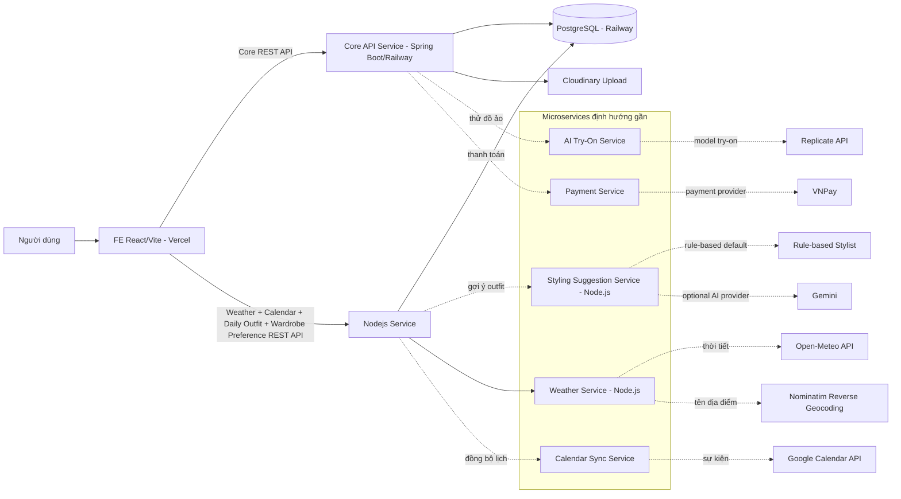

# Shelfy - Tổng Quan Dự Án

## Mục Đích Tài Liệu

Tài liệu này dùng cho team dev để onboarding và nắm bức tranh tổng thể của Shelfy. Đây là tài liệu sống: mọi dev cần cập nhật khi có thay đổi lớn về tính năng, API, kiến trúc, deployment hoặc database.

## Sản Phẩm

Shelfy là ứng dụng quản lý tủ đồ cá nhân. Người dùng có thể đăng ký, đăng nhập, lưu trữ các món đồ trong tủ, upload ảnh trang phục, xem thống kê tủ đồ và nhận gợi ý phối đồ.

Shelfy được định hướng là dự án **microservice-oriented**. `BE/Shelfy` hiện là **Core API Service** đang chạy production, không phải toàn bộ hệ thống cuối cùng. Các năng lực mới từ thời điểm hiện tại sẽ ưu tiên triển khai trong `Nodejs`; không mở rộng thêm code Java nếu không có quyết định kiến trúc riêng.

Định hướng sản phẩm gồm:

- Lưu trữ và quản lý tủ đồ cá nhân.
- Gợi ý trang phục dựa trên tủ đồ, thời tiết và lịch trình; hiện mặc định dùng rule-based để không tốn token AI.
- Lấy thông tin thời tiết từ API thời tiết thật.
- Lấy lịch trình từ calendar để tạo ngữ cảnh gợi ý trang phục.
- Dùng AI try-on để tạo ảnh mô phỏng người dùng khi mặc một trang phục.

Người dùng mục tiêu là cá nhân muốn quản lý tủ đồ và chọn trang phục hằng ngày hiệu quả hơn.

## Trạng Thái Chức Năng

| Nhóm chức năng | Trạng thái | Ghi chú |
| --- | --- | --- |
| Login | Đang dùng production | FE đã gọi Core API Service thật. |
| Register | Đang dùng production | FE đã gọi Core API Service thật. |
| Profile cá nhân | Đang dùng production | FE có màn riêng để xem hồ sơ, cập nhật tên hiển thị và đổi mật khẩu qua user-controller. |
| Lưu trữ đồ | Đang dùng production | Wardrobe item, upload ảnh, stats, filter, xem chi tiết, sửa, xóa, yêu thích, trang danh sách yêu thích và trạng thái món đồ đã có API. Core data vẫn ở Java, preference/status mở rộng nằm ở Nodejs. |
| Outfit library riêng | Đã gỡ khỏi FE | Không còn route `/outfits` và không còn sidebar item Outfit. Core API `/api/outfits` vẫn tồn tại nhưng FE không expose màn quản lý outfit riêng. |
| Outfit mặc hôm nay | Đang triển khai trong Nodejs | FE cho phép người dùng tự chọn món trong tủ, xác nhận bộ sẽ mặc trong ngày, xem lịch sử outfit đã mặc ở `/wear-history`; Nodejs lưu/list `daily_outfits`, tạo outfit nếu cần và cập nhật `wear_count`. |
| Gợi ý đồ theo ngữ cảnh | Đang triển khai trong Nodejs | FE `/suggest` gọi Nodejs `POST /api/suggestions/today` để tạo gợi ý bằng rule-based stylist, lưu kết quả vào Postgres chung và cho phép xác nhận outfit mặc hôm nay qua Daily Outfit API. |
| Thử đồ bằng AI | Định hướng dùng model thật | Model mục tiêu là Replicate `cuuupid/idm-vton:0513734a452173b8173e907e3a59d19a36266e55b48528559432bd21c7d7e985`. |
| Thời tiết | Đang tách sang Nodejs | Java đã bỏ `/api/home` và weather hard-code. FE gọi Nodejs service, Nodejs gọi Open-Meteo để lấy thời tiết, gọi Nominatim reverse geocoding để lấy tên địa điểm và lưu snapshot vào Postgres chung. |
| Calendar | Đang triển khai trong Nodejs | `/home` không dùng `/api/events` của Java. FE gọi Nodejs để kết nối Google Calendar thật qua OAuth và lấy lịch trình hôm nay từ Google Calendar API. |
| Payment/Premium | Chưa ưu tiên | Có module VNPay ở Core API Service nhưng chưa test end-to-end; quyết định luồng thanh toán sẽ làm sau. |

## Kiến Trúc Tổng Quan



## Ranh Giới Microservice

| Service | Trạng thái | Vai trò |
| --- | --- | --- |
| FE Web App | Đang có | React + Vite UI, deploy Vercel, gọi REST API. |
| Core API Service | Đang có | `BE/Shelfy`, Spring Boot, xử lý auth, user, wardrobe, outfit, subscription/payment hiện tại. Không còn sở hữu weather, không còn `/api/home`, FE không dùng Java event API cho lịch trình thật, và không ưu tiên thêm feature mới vào Java. |
| Nodejs Service | Đang có weather, calendar, daily outfit, wardrobe preference và suggestion | `Nodejs`, Express API, verify JWT do Core API phát hành, gọi Open-Meteo/Nominatim cho weather, xử lý Google Calendar OAuth, gọi Google Calendar API, lưu snapshot lịch, lưu outfit mặc hôm nay, trả lịch sử outfit đã mặc, lưu metadata mở rộng của wardrobe item và tạo gợi ý outfit bằng rule-based stylist. |
| Styling Suggestion Service | Đang triển khai trong `Nodejs` | Node.js service chấm điểm item bằng luật dựa trên weather snapshot, calendar context, favorite/trạng thái item, chất liệu/màu/mùa và lịch sử mặc gần đây. Gemini chỉ còn là hướng tùy chọn nếu cần phân tích ảnh hoặc viết lại lời gợi ý tự nhiên hơn. |
| AI Try-On Service | Dự kiến hoặc gộp vào AI service | Gọi Replicate IDM-VTON, quản lý job/poll/result cho thử đồ ảo. |
| Weather Service | Đang triển khai trong `Nodejs` | Gọi Open-Meteo thật, reverse geocode tọa độ thành tên địa điểm, chuẩn hóa dữ liệu thời tiết cho FE và lưu snapshot cho suggestion sau này. |
| Calendar Sync Service | Đang triển khai trong `Nodejs` | Kết nối Google Calendar qua OAuth, lưu token đã mã hóa, fetch sự kiện trong ngày và lưu vào Postgres chung để FE và suggestion dùng lại. |
| Payment Service | Làm sau | Có thể tách VNPay/payment flow ra khỏi Core API khi chốt luồng production. |

Hiện tại FE gọi thẳng Core API Service và Nodejs Service. Chưa có API Gateway riêng. Khi tách service mới, ưu tiên giữ contract REST rõ ràng, mỗi service có env riêng và không để FE gọi thẳng Gemini, Replicate, Open-Meteo, Nominatim hoặc payment provider.

## Thành Phần Chính

| Thành phần | Đường dẫn | Vai trò |
| --- | --- | --- |
| Frontend | `FE/Shelfyy` | React + Vite UI, gọi API qua `src/api`. |
| Core API Service | `BE/Shelfy` | Spring Boot REST API, auth, domain logic, persistence, service boundary hiện tại. |
| Nodejs Service | `Nodejs` | Express service cho weather, calendar, outfit mặc hôm nay, wardrobe item preference và stylist suggestion; sau này mở rộng try-on/payment. |
| Database | PostgreSQL Railway | Lưu user, wardrobe, outfit, calendar event, weather snapshot, try-on, subscription, payment. |
| File storage | Cloudinary | Lưu ảnh avatar, ảnh trang phục, ảnh try-on input/result. |
| Styling suggestion | Rule-based trong Nodejs | Mặc định không gọi AI provider; Gemini có thể dùng sau nếu cần đọc ảnh hoặc viết lại text. |
| AI try-on | Replicate | Dùng model IDM-VTON. |
| Weather | Open-Meteo + Nominatim | Lấy thời tiết thật theo tọa độ người dùng và lấy tên địa điểm từ tọa độ, không dùng fallback demo. |
| Payment | VNPay | Có module nhưng chưa chốt flow production. |

## Frontend

FE dùng React + Vite. API base production hiện trỏ tới:

```text
https://shelfyy-production-4f6e.up.railway.app/api
```

Weather, Calendar, Daily Outfit và Wardrobe Preference gọi Nodejs Service qua biến:

```text
VITE_NODE_API_BASE_URL
```

Các API wrapper chính nằm trong `FE/Shelfyy/src/api`:

| File | Vai trò |
| --- | --- |
| `apiClient.js` | Fetch wrapper, build URL, parse response, proactive refresh khi access token sắp hết hạn, single-flight refresh khi gặp `401`. |
| `nodeApiClient.js` | Fetch wrapper riêng cho Nodejs Service, dùng `VITE_NODE_API_BASE_URL`. |
| `authApi.js` | Login, register, refresh token, forgot password, reset password, logout. |
| `userApi.js` | Profile hiện tại, update profile, đổi mật khẩu. |
| `weatherApi.js` | Gọi Nodejs Weather API, tạo weather snapshot và lấy snapshot mới nhất. |
| `calendarApi.js` | Gọi Nodejs Calendar API để lấy lịch hôm nay, kiểm tra trạng thái và bắt đầu OAuth Google Calendar. |
| `dailyOutfitApi.js` | Gọi Nodejs Daily Outfit API để xác nhận outfit sẽ mặc hôm nay, lấy outfit đã xác nhận và list lịch sử outfit đã mặc. |
| `suggestionApi.js` | Gọi Nodejs Suggestion API để lấy gợi ý mới nhất, tạo gợi ý rule-based mới và đánh dấu gợi ý đã được xác nhận mặc hôm nay. |
| `wardrobePreferenceApi.js` | Gọi Nodejs Wardrobe Preference API để đọc/cập nhật yêu thích và trạng thái món đồ. |
| `wardrobeApi.js` | Wardrobe items, chi tiết món đồ, cập nhật, xóa mềm, stats, pairings, mark worn. |
| `uploadApi.js` | Upload clothing/avatar bằng multipart form-data. |
| `trialApi.js` | Generate try-on job, status, history. |
| `subscriptionApi.js` | Plans, current plan, upgrade, cancel. |
| `paymentApi.js` | Tạo VNPay payment URL. |
| `adapters.js` | Map response Core API sang shape UI đang dùng. |

FE đã có các page chính:

- Landing/login/register.
- Home.
- Profile cá nhân.
- Wardrobe.
- Yêu thích.
- Lịch sử outfit đã mặc.
- Trial.
- Suggest.
- Premium.
- Forgot/reset password.

## Backend / Core API Service

`BE/Shelfy` là Core API Service hiện tại trong kiến trúc microservice của Shelfy. Service này dùng Spring Boot 3.3.5, Java 17. Cấu trúc chính:

| Package | Vai trò |
| --- | --- |
| `controller` | REST endpoints. |
| `service` / `service.impl` | Business logic. |
| `repository` | Spring Data JPA repositories. |
| `entity` | Entity mapping database. |
| `dto.request` | Request DTO. |
| `dto.response` | Response DTO. |
| `security` | JWT, UserDetails, auth filter, token hash. |
| `config` | Security, Cloudinary, VNPay, OpenAPI, REST client. |
| `exception` | Error code và global exception handler. |
| `resources/db/migration` | Flyway migrations. |

Security hiện dùng JWT stateless:

- Access token: gửi qua `Authorization: Bearer <token>`.
- Refresh token: raw token trả về FE, hash SHA-256 lưu DB.
- FE gọi `/api/auth/refresh` bằng refresh token body, lưu access token và refresh token mới vì Core API đang dùng refresh token rotation.
- FE dùng single-flight refresh để nhiều request đồng thời không cùng dùng một refresh token cũ và tự làm hỏng session.
- Hầu hết endpoint cần auth, trừ auth endpoints, plan list, VNPay callback/IPN, Swagger và health check.

Lưu ý: account `demo@shelfy.app / 123456` hiện đang không login được trên Railway. Nguyên nhân nghi ngờ là migration seed tạo user `demo@shelfy.app` nhưng credential lại insert cho `user@shelfy.app`.

## Deployment

| Thành phần | Nơi deploy |
| --- | --- |
| FE | Vercel |
| Core API Service | Railway |
| Database | PostgreSQL Railway |
| Image storage | Cloudinary |

FE production gọi thẳng Core API Service trên Railway. Không dùng Core API local cho production.

Lưu ý: production cần deploy Nodejs Service riêng và cấu hình `VITE_NODE_API_BASE_URL` trên Vercel.

## API Chính

### Auth

| Method | Endpoint | Auth | Response chính |
| --- | --- | --- | --- |
| `POST` | `/api/auth/register` | Không | `AuthResponse` |
| `POST` | `/api/auth/login` | Không | `AuthResponse` |
| `POST` | `/api/auth/refresh` | Không | `AuthResponse` |
| `POST` | `/api/auth/logout` | Có | `204 No Content` |
| `POST` | `/api/auth/forgot-password` | Không | `{ message }` |
| `POST` | `/api/auth/reset-password` | Không | `{ message }` |

`AuthResponse`:

```json
{
  "accessToken": "...",
  "refreshToken": "...",
  "expiresIn": 900000,
  "user": {
    "id": 1,
    "publicId": "uuid",
    "email": "user@example.com",
    "fullName": "User Name",
    "avatarUrl": null,
    "status": "ACTIVE",
    "plan": "FREE",
    "planExpiresAt": null,
    "storageUsed": 0,
    "storageLimit": 100,
    "tryOnCountToday": 0,
    "tryOnLimit": 5
  }
}
```

### User

| Method | Endpoint | Auth | Response chính |
| --- | --- | --- | --- |
| `GET` | `/api/users/me` | Có | `UserProfileResponse` |
| `PUT` | `/api/users/me` | Có | `UserProfileResponse` |
| `PUT` | `/api/users/me/password` | Có | `204 No Content` |

### Wardrobe

| Method | Endpoint | Auth | Response chính |
| --- | --- | --- | --- |
| `GET` | `/api/wardrobe/items` | Có | `Page<ClothingItemResponse>` |
| `POST` | `/api/wardrobe/items` | Có | `ClothingItemResponse` |
| `GET` | `/api/wardrobe/items/{id}` | Có | `ClothingItemResponse` |
| `PUT` | `/api/wardrobe/items/{id}` | Có | `ClothingItemResponse` |
| `DELETE` | `/api/wardrobe/items/{id}` | Có | `204 No Content` |
| `GET` | `/api/wardrobe/items/{id}/pairings` | Có | `List<PairingSuggestionResponse>` |
| `PATCH` | `/api/wardrobe/items/{id}/wear` | Có | `ClothingItemResponse` |
| `GET` | `/api/wardrobe/stats` | Có | `WardrobeStatsResponse` |

FE `/wardrobe` có drawer xem chi tiết món đồ. Khi user click vào card hoặc ảnh món đồ, FE gọi `GET /api/wardrobe/items/{id}` để lấy dữ liệu mới nhất và hiển thị ảnh lớn, phân loại, màu sắc, size, chất liệu, mùa, họa tiết, tags, số lần mặc, lần mặc gần nhất, ngày thêm/cập nhật và thông tin mua sắm nếu có.

FE `/favorites` là trang riêng để xem các món đã đánh dấu yêu thích. Trang này lấy wardrobe item từ Java, gọi Nodejs `GET /api/wardrobe/preferences` để merge favorite/status, sau đó chỉ hiển thị item có `favorite=true`. User có thể tìm kiếm, lọc theo trạng thái, mở drawer chi tiết, đổi trạng thái, sửa/xóa item hoặc bỏ yêu thích để item biến khỏi danh sách.

Trong drawer, user có thể:

- `Sửa`: mở modal sửa metadata và gọi `PUT /api/wardrobe/items/{id}`. FE giữ ảnh hiện tại, chỉ sửa thông tin món đồ.
- `Xóa`: mở dialog xác nhận và gọi `DELETE /api/wardrobe/items/{id}`. FE xóa item khỏi grid, bỏ khỏi outfit hôm nay nếu item đang được chọn và refresh stats.
- `Chọn cho outfit hôm nay`: đưa món đồ vào bộ đồ sẽ mặc trong ngày.
- `Yêu thích`: gọi Nodejs `PUT /api/wardrobe/items/{id}/preferences` để bật/tắt favorite.
- `Trạng thái`: gọi Nodejs `PUT /api/wardrobe/items/{id}/preferences` để đổi trạng thái item.

#### Wardrobe Preference - Nodejs Service

Base URL dùng `VITE_NODE_API_BASE_URL`. FE lấy danh sách item từ Java trước, sau đó gọi Nodejs để merge preference/status vào card và drawer. Nodejs kiểm tra item thuộc user hiện tại trước khi ghi.

| Method | Endpoint | Auth | Response chính |
| --- | --- | --- | --- |
| `GET` | `/api/wardrobe/preferences?itemIds=1,2,3` | Có | `{ items: WardrobePreference[] }` |
| `PUT` | `/api/wardrobe/items/{id}/preferences` | Có | `WardrobePreference` |

`PUT /api/wardrobe/items/{id}/preferences` nhận body:

```json
{
  "favorite": true,
  "status": "TO_SELL"
}
```

`status` hợp lệ:

- `IN_USE`: đang dùng.
- `RARELY_USED`: ít mặc.
- `STORED`: cất kho.
- `TO_SELL`: muốn thanh lý.

`ClothingItemResponse`:

```json
{
  "id": 1,
  "name": "Áo thun trắng",
  "brand": "Khác",
  "category": "TOP",
  "subCategory": null,
  "color": "Trắng",
  "colorHex": "#ffffff",
  "season": "Bốn mùa",
  "pattern": "Trơn",
  "size": "M",
  "material": "Cotton",
  "imageUrl": "https://...",
  "thumbnailUrl": "https://...",
  "backgroundRemovedUrl": null,
  "tags": [],
  "wearCount": 0,
  "lastWornAt": null,
  "purchasePrice": null,
  "purchaseDate": null,
  "sourceUrl": null,
  "favorite": false,
  "createdAt": "2026-07-21T00:00:00"
}
```

### Upload

| Method | Endpoint | Auth | Request | Response chính |
| --- | --- | --- | --- | --- |
| `POST` | `/api/upload/clothing` | Có | Multipart `file` | `ImageUploadResult` |
| `POST` | `/api/upload/avatar` | Có | Multipart `file` | `ImageUploadResult` |

`ImageUploadResult`:

```json
{
  "fileId": 1,
  "originalUrl": "https://...",
  "thumbnailUrl": "https://...",
  "backgroundRemovedUrl": null,
  "publicId": "cloudinary-public-id"
}
```

### Weather - Nodejs Service

Base URL dùng `VITE_NODE_API_BASE_URL`.

| Method | Endpoint | Auth | Response chính |
| --- | --- | --- | --- |
| `POST` | `/api/weather/snapshots` | Có | `WeatherSnapshotResponse` |
| `GET` | `/api/weather/snapshots/latest` | Có | `WeatherSnapshotResponse` |

`POST /api/weather/snapshots` nhận body:

```json
{
  "lat": 10.7769,
  "lon": 106.7009
}
```

`WeatherSnapshotResponse`:

```json
{
  "id": 1,
  "provider": "OPEN_METEO",
  "latitude": 10.7769,
  "longitude": 106.7009,
  "timezone": "Asia/Ho_Chi_Minh",
  "location": "Hồ Chí Minh",
  "temperature": 26.1,
  "feelsLike": 28.3,
  "humidity": 87,
  "precipitation": 0,
  "rain": 0,
  "weatherCode": 0,
  "condition": "Trời quang",
  "icon": "light_mode",
  "cloudCover": 20,
  "windSpeed": 4.8,
  "windDirection": 120,
  "windGusts": 11.2,
  "isDay": false,
  "observedAt": "2026-07-21T18:00:00.000Z",
  "createdAt": "2026-07-21T18:00:01.000Z"
}
```

### Calendar - Nodejs Service

FE không dùng `/api/events` của Java cho `/home` nữa. Calendar thật đi qua Nodejs Service và Google OAuth. FE không nhận access token/refresh token của Google; token được Nodejs mã hóa và lưu trong Postgres chung.

| Method | Endpoint | Auth | Response chính |
| --- | --- | --- | --- |
| `GET` | `/api/calendar/status` | Có | Trạng thái kết nối Google Calendar. |
| `POST` | `/api/calendar/google/connect` | Có | `{ authorizationUrl, expiresAt }` để FE redirect sang Google consent. |
| `GET` | `/api/calendar/google/callback` | Không | Callback OAuth từ Google, sau đó redirect về FE `/home`. |
| `GET` | `/api/calendar/today` | Có | Lịch trình hôm nay từ Google Calendar API và snapshot đã lưu DB. |
| `DELETE` | `/api/calendar/google/disconnect` | Có | `204 No Content`, xóa token đã lưu. |

`CalendarTodayResponse`:

```json
{
  "connected": true,
  "provider": "GOOGLE",
  "email": "user@gmail.com",
  "connectedAt": "2026-07-22T02:00:00.000Z",
  "lastSyncedAt": "2026-07-22T02:05:00.000Z",
  "calendarUrl": "https://calendar.google.com/calendar/u/0/r",
  "date": "2026-07-22",
  "timeZone": "Asia/Ho_Chi_Minh",
  "events": [
    {
      "id": "google-event-id",
      "title": "Meeting",
      "startTime": "09:00",
      "endTime": "10:00",
      "time": null,
      "allDay": false,
      "location": "Office",
      "description": "",
      "htmlLink": "https://calendar.google.com/..."
    }
  ]
}
```

### Outfit

Lưu ý: FE đã gỡ trang `/outfits`. Các endpoint Core API dưới đây vẫn tồn tại ở backend nhưng hiện không còn màn quản lý outfit riêng trong sidebar/router.

| Method | Endpoint | Auth | Response chính |
| --- | --- | --- | --- |
| `GET` | `/api/outfits` | Có | `Page<OutfitResponse>` |
| `POST` | `/api/outfits` | Có | `OutfitResponse` |
| `DELETE` | `/api/outfits/{id}` | Có | `204 No Content` |

### Daily Outfit - Nodejs Service

Base URL dùng `VITE_NODE_API_BASE_URL`.

| Method | Endpoint | Auth | Response chính |
| --- | --- | --- | --- |
| `GET` | `/api/daily-outfits` | Có | Lịch sử daily outfit dạng phân trang, hỗ trợ `page`, `size`, `from`, `to`. |
| `GET` | `/api/daily-outfits/today` | Có | Daily outfit đã xác nhận cho hôm nay hoặc ngày truyền qua `?date=YYYY-MM-DD`. |
| `POST` | `/api/daily-outfits` | Có | Xác nhận outfit sẽ mặc trong ngày. |

`POST /api/daily-outfits` có hai chế độ:

- FE gửi `itemIds`: Nodejs tự tạo outfit trong bảng `outfits`, tạo `outfit_items`, upsert `daily_outfits` theo `user_id + worn_date`, rồi cập nhật `wear_count`.
- FE gửi `outfitId`: Nodejs xác nhận một outfit đã tồn tại là outfit mặc trong ngày.

Body tự chọn từ tủ đồ:

```json
{
  "name": "Outfit hôm nay - 22/07/2026",
  "occasion": "Hôm nay",
  "description": "Người dùng tự chọn trong tủ đồ cá nhân.",
  "itemIds": [1, 2, 3],
  "wornDate": "2026-07-22"
}
```

Response chính:

```json
{
  "id": 1,
  "confirmed": true,
  "wornDate": "2026-07-22",
  "confirmedAt": "2026-07-22T08:00:00.000Z",
  "outfit": {
    "id": 10,
    "name": "Outfit hôm nay - 22/07/2026",
    "itemIds": [1, 2, 3],
    "items": []
  },
  "wearCountUpdated": {
    "addedItemIds": [1, 2, 3],
    "removedItemIds": []
  }
}
```

`GET /api/daily-outfits` trả page response:

```json
{
  "content": [],
  "page": 0,
  "size": 12,
  "totalElements": 0,
  "totalPages": 0,
  "numberOfElements": 0,
  "first": true,
  "last": true
}
```

### Suggestion - Nodejs Service

Base URL dùng `VITE_NODE_API_BASE_URL`. FE `/suggest` chỉ gọi Nodejs; FE không giữ API key của provider AI.

| Method | Endpoint | Auth | Response chính |
| --- | --- | --- | --- |
| `GET` | `/api/suggestions/today/latest` | Có | Gợi ý mới nhất của ngày hiện tại nếu đã có, kèm context weather/calendar/wardrobe count. |
| `POST` | `/api/suggestions/today` | Có | Tạo gợi ý mới bằng rule-based stylist, lưu vào Postgres chung. |
| `POST` | `/api/suggestions/{id}/confirm` | Có | Đánh dấu gợi ý đã được xác nhận mặc hôm nay, có thể gắn `dailyOutfitId`. |

Luồng FE hiện tại:

1. Vào `/suggest`, FE gọi `GET /api/suggestions/today/latest`.
2. Nếu chưa có gợi ý, user bấm `Tạo gợi ý`; FE cố gắng tạo weather snapshot mới từ vị trí hiện tại rồi gọi `POST /api/suggestions/today`.
3. Nodejs đọc `wardrobe_items`, `wardrobe_item_preferences`, `weather_snapshots`, `calendar_events` và recent `daily_outfits`, sau đó rule engine chấm điểm item để chọn outfit.
4. User bấm `Xác nhận mặc hôm nay`; FE gọi `POST /api/daily-outfits`, sau đó gọi `POST /api/suggestions/{id}/confirm`.

`POST /api/suggestions/today` có thể trả lỗi rõ:

- `WARDROBE_CONTEXT_EMPTY`: user chưa có món đồ hợp lệ trong tủ.

Gemini env chỉ còn là cấu hình tùy chọn nếu sau này bật lại provider AI:

```text
GEMINI_API_KEY=
GEMINI_MODEL=gemini-2.5-flash
GEMINI_API_BASE_URL=https://generativelanguage.googleapis.com/v1beta
GEMINI_TIMEOUT_MS=20000
GEMINI_INCLUDE_ITEM_IMAGES=false
GEMINI_IMAGE_ALLOWED_HOSTS=res.cloudinary.com
GEMINI_MAX_INLINE_IMAGES=8
GEMINI_MAX_IMAGE_BYTES=2500000
```

Mặc định flow hiện tại không gọi Gemini và không fetch ảnh từ URL trong DB. Khi cần Gemini đọc pixel ảnh thật, bật `GEMINI_INCLUDE_ITEM_IMAGES=true` và chỉ allowlist host ảnh tin cậy như Cloudinary.

### Trial / AI Try-On

| Method | Endpoint | Auth | Response chính |
| --- | --- | --- | --- |
| `POST` | `/api/trial/generate` | Có | `TryOnJobResponse` |
| `GET` | `/api/trial/{jobId}/status` | Có | `TryOnStatusResponse` |
| `GET` | `/api/trial/history` | Có | `Page<TryOnHistoryResponse>` |
| `DELETE` | `/api/trial/history/{id}` | Có | `204 No Content` |

`TryOnJobResponse`:

```json
{
  "jobId": 1,
  "predictionId": "replicate-prediction-id",
  "status": "PENDING"
}
```

`TryOnStatusResponse`:

```json
{
  "jobId": 1,
  "status": "DONE",
  "resultImageUrl": "https://...",
  "processingTimeMs": 4200,
  "accuracy": "98.4%",
  "createdAt": "2026-07-21T00:00:00"
}
```

### Subscription Và Payment

| Method | Endpoint | Auth | Response chính |
| --- | --- | --- | --- |
| `GET` | `/api/subscription/plans` | Không | `List<PlanResponse>` |
| `GET` | `/api/subscription/me` | Có | `PlanResponse` |
| `POST` | `/api/subscription/upgrade` | Có | `PlanResponse` |
| `POST` | `/api/subscription/cancel` | Có | `PlanResponse` |
| `POST` | `/api/payments/vnpay/create` | Có | `PaymentUrlResponse` |
| `GET` | `/api/payments/vnpay/callback` | Không | `302 Redirect` |
| `GET` | `/api/payments/vnpay/ipn` | Không | `{ RspCode, Message }` |

Payment chưa được xem là flow production đã chốt. Module VNPay tồn tại nhưng chưa test end-to-end.

## Database Chính

Core API migrations đang nằm tại `BE/Shelfy/src/main/resources/db/migration`. Các bảng do Nodejs service sở hữu mới thêm nằm trong `Nodejs/migrations` và chạy bằng `npm run migrate` trong thư mục `Nodejs`.

Các bảng chính:

| Bảng | Vai trò |
| --- | --- |
| `users` | Tài khoản, plan, quota lưu trữ, quota try-on. |
| `auth_credentials` | Password hash, login failure count, lock state. |
| `roles`, `permissions`, `user_roles`, `role_permissions` | RBAC. |
| `refresh_tokens` | Refresh token hash, revoke/replace token. |
| `password_reset_tokens` | Token reset password đã hash. |
| `file_assets` | Metadata ảnh trên Cloudinary. |
| `wardrobe_items` | Món đồ trong tủ. |
| `wardrobe_item_preferences` | Metadata mở rộng của món đồ theo từng user, do Nodejs quản lý: yêu thích và trạng thái item. |
| `outfits`, `outfit_items` | Outfit và item thuộc outfit. |
| `daily_outfits` | Outfit người dùng xác nhận mặc theo từng ngày; do Nodejs quản lý, unique theo `user_id + worn_date`, có thể gắn weather snapshot/calendar event để phục vụ suggestion sau này. |
| `calendar_events` | Lưu snapshot sự kiện đã fetch từ Google Calendar để FE và suggestion dùng lại. Không dùng Java `/api/events` làm nguồn lịch trình thật cho `/home`. |
| `calendar_connections` | Lưu trạng thái kết nối Google Calendar, provider email, scope và Google token đã mã hóa. |
| `calendar_oauth_states` | Lưu OAuth state đã hash để chống CSRF/replay trong callback Google. |
| `weather_snapshots` | Snapshot thời tiết theo user/vị trí, do Nodejs lưu để FE hiển thị và suggestion dùng lại. |
| `ai_suggestions` | Bảng gợi ý AI cũ từ Core schema, chưa dùng cho flow FE `/suggest` mới. |
| `ai_style_suggestions`, `ai_style_suggestion_items` | Gợi ý stylist do Nodejs quản lý: lưu output rule engine hoặc provider AI tùy cấu hình, context đã dùng, các item được chọn, trạng thái confirm và liên kết tới `daily_outfits`. |
| `try_on_sessions` | Job thử đồ AI, trạng thái, prediction id, result file. |
| `plans`, `subscriptions` | Gói và đăng ký. |
| `payments` | Giao dịch thanh toán. |
| `audit_logs` | Log hành động hệ thống. |

Một số constraint quan trọng:

- `wardrobe_items.category` chỉ nhận nhóm như `TOP`, `BOTTOM`, `DRESS`, `SHOES`, `BAG`, `ACCESSORY`, `OUTERWEAR`, `OTHER`.
- `wardrobe_item_preferences.item_status` gồm `IN_USE`, `RARELY_USED`, `STORED`, `TO_SELL`.
- `try_on_sessions.status` gồm `PENDING`, `PROCESSING`, `COMPLETED`, `FAILED`.
- `payments.payment_status` gồm `PENDING`, `SUCCESS`, `FAILED`, `REFUNDED`, `CANCELLED`.
- `users.storage_limit = -1` nghĩa là không giới hạn.

## Tích Hợp AI Và Dịch Vụ Ngoài

### Rule-Based Stylist

Gợi ý trang phục hiện dùng rule-based stylist trong Nodejs Service. Nodejs chấm điểm từng item theo luật và trả JSON có `title`, `occasion`, `summary`, `reason`, `confidence`, `tips` và danh sách `items`.

Input hiện tại gồm:

- Metadata tủ đồ: category, màu, mùa, chất liệu, pattern, size, brand.
- Favorite và trạng thái item từ `wardrobe_item_preferences`.
- Weather snapshot gần nhất của user.
- Calendar events đã đồng bộ trong ngày.
- Item đã mặc gần đây từ `daily_outfits`.

Luật hiện tại ưu tiên item đang dùng/yêu thích, chất liệu thoáng cho ngày nóng/ẩm, item chỉn chu cho lịch công việc, giày phù hợp khi có mưa hoặc phải di chuyển, đồng thời giảm điểm món đã mặc gần đây hoặc đang cất. Gemini có thể được bật lại sau nếu cần đọc pixel ảnh thật hoặc viết lại lời gợi ý tự nhiên hơn.

### Replicate IDM-VTON

Try-on dùng Replicate API với model:

```text
cuuupid/idm-vton:0513734a452173b8173e907e3a59d19a36266e55b48528559432bd21c7d7e985
```

Kỳ vọng:

- Input: ảnh người dùng và ảnh trang phục.
- Output: ảnh kết quả mô phỏng người dùng mặc trang phục.

### Open-Meteo Và Nominatim

Weather dùng Open-Meteo trong Nodejs Service. FE gửi tọa độ hiện tại của user lên Nodejs; Nodejs gọi Open-Meteo, map `weather_code` sang mô tả tiếng Việt, gọi Nominatim reverse geocoding để lấy `location_label`, lưu snapshot vào Postgres và trả dữ liệu đã chuẩn hóa cho FE.

Nếu reverse geocoding lỗi hoặc không tìm được tên địa điểm, Nodejs vẫn trả dữ liệu thời tiết thật và dùng nhãn `Vị trí hiện tại`, không tự sinh tên thành phố giả.

Nếu user không cấp quyền vị trí, FE phải báo rõ không có quyền vị trí và không dùng dữ liệu thời tiết giả.

### Google Calendar

Calendar thật do Nodejs xử lý. FE không gọi trực tiếp Google Calendar API và không dùng `/api/events` của Java cho màn `/home`. Luồng hiện tại:

1. User cấp quyền Google Calendar qua OAuth.
2. Nodejs lưu token đã mã hóa trong Postgres chung.
3. Nodejs gọi Google Calendar API để lấy sự kiện trong ngày.
4. Nodejs chuẩn hóa dữ liệu, lưu lại để suggestion dùng context lịch trình.
5. FE gọi Nodejs API như `/api/calendar/today` để hiển thị lịch trình hôm nay.

Biến môi trường chính:

```text
GOOGLE_CLIENT_ID
GOOGLE_CLIENT_SECRET
GOOGLE_CALENDAR_REDIRECT_URI
GOOGLE_CALENDAR_SCOPES
CALENDAR_TOKEN_ENCRYPTION_KEY
```

## Bảo Mật Và Secrets

Không commit các file chứa secret:

- `.env`
- `.env.local`
- `*.env`
- file copy như `BE/.env (1)`

Các giá trị như JWT secret, database password, Cloudinary key, Replicate token, VNPay secret phải được cấu hình qua môi trường deploy hoặc file env local không commit.

FE chỉ được commit các biến public kiểu `VITE_API_BASE_URL`, `VITE_NODE_API_BASE_URL` khi giá trị không phải secret. URL production là public endpoint nên có thể nằm trong env deploy.

## Lưu Ý Hiện Trạng

- Tên chính thức của dự án là **Shelfy**.
- FE production dự kiến deploy Vercel.
- Core API Service production đang deploy Railway.
- Database production dùng PostgreSQL Railway.
- FE gọi thẳng Core API Service trên Railway và gọi thẳng Nodejs Service qua `VITE_NODE_API_BASE_URL`.
- Profile cá nhân đã có màn riêng ở FE và dùng các endpoint `/api/users/me`, `/api/users/me/password`.
- Java đã xóa `/api/home`; weather thuộc Nodejs Service.
- Tính năng mới từ hiện tại ưu tiên triển khai bằng Nodejs; không thêm code Java cho feature mới nếu không có quyết định riêng.
- `demo@shelfy.app / 123456` hiện không login được trên Railway; cần sửa seed credential nếu muốn dùng demo account.
- Payment chưa chốt flow production.
- Weather dùng Open-Meteo và Nominatim, không cần API key ở giai đoạn hiện tại.
- Calendar trên `/home` đã bỏ nguồn `/api/events` Java; hiện gọi Nodejs Calendar API để kết nối Google Calendar thật và lấy lịch hôm nay.
- Outfit mặc hôm nay đã có boundary Nodejs: FE `/wardrobe` gọi `POST /api/daily-outfits` để xác nhận bộ đồ sẽ mặc; FE `/wear-history` gọi `GET /api/daily-outfits` để xem lịch sử mặc lưu trong `daily_outfits`.
- Favorite và trạng thái món đồ đã có boundary Nodejs: FE `/wardrobe` và `/favorites` gọi `GET /api/wardrobe/preferences` để merge metadata vào item từ Java và gọi `PUT /api/wardrobe/items/{id}/preferences` khi user thích hoặc đổi trạng thái item.
- Gợi ý hôm nay đã có boundary Nodejs: FE `/suggest` gọi `GET /api/suggestions/today/latest`, `POST /api/suggestions/today` và `POST /api/suggestions/{id}/confirm`; mặc định dùng rule-based stylist, không cần Gemini API key.
